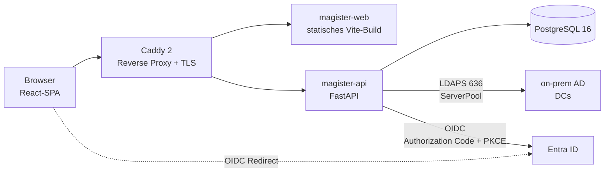

# Magister · ARCHITECTURE

> **Magister** — User & class management for schools
> Part of **Schola Levis** by **Vita Brevis**

## 1. Übersicht

Magister besteht aus einem React-SPA, einem FastAPI-Backend, einer PostgreSQL-Datenbank und einer LDAPS-Verbindung zum on-prem Active Directory des Schulträgers. Authentifizierung erfolgt via OIDC gegen Entra ID; AD-Mutationen (Passwort-Reset, Enable/Disable) gehen via ldap3 ServerPool gegen die explizit konfigurierten Domain Controller des Schulträgers.



## 2. Tech-Stack-Begründungen

| Komponente | Wahl | Begründung |
|------------|------|------------|
| Backend | FastAPI 0.111+ | OpenAPI gratis, async, schnelle Entwicklung; integriert sauber mit Pydantic v2 |
| LDAP-Library | ldap3 | reifste Python-LDAP-Lib für AD-Writes (`unicodePwd`, `pwdLastSet`); ServerPool für Failover |
| ORM | SQLAlchemy 2 + Alembic | async-Support, robuste Migrations, JSONB-Native |
| Frontend | React + Vite + TanStack | de-facto Standard; TanStack Query für Server-State, TanStack Router für typisierte Routes |
| UI-Kit | shadcn/ui + Tailwind | kopierbare Komponenten, kein Vendor-Lock; barrierearm |
| i18n | i18next + react-i18next | bewährt, nativer Support für Plural-/Genus-Regeln; DE/FR/IT/EN |
| DB | PostgreSQL 16 | JSONB für Audit-Payloads, partial indexes, optionales Row-Level-Security |
| Reverse Proxy | Caddy 2 | Auto-TLS via ACME, minimale Konfig, single-binary |
| Container-Stack | Docker Compose | reproduzierbar, einfache Update-Mechanik via `compose pull` |
| Auth | OIDC gegen Entra | Conditional Access bringt MFA mit; Entra ist Sync-Target des on-prem AD |
| CI | GitHub Actions | Repo-nativ; ausreichend für Build/Test/Image-Push |

## 3. Datenflüsse

### 3.1 Login (Lehrer / Admin)

1. Browser → `/auth/login` → API redirected zu Entra `/authorize?response_type=code&...`
2. Entra → Browser-Redirect mit `code` zu `/auth/callback`
3. API tauscht `code` gegen `id_token` + `access_token` (Backchannel)
4. API matched OIDC `oid` claim gegen `ad_user_cache.ms_ds_consistency_guid`; Fallback bei fehlendem Match: UPN-Gleichheit. Match-Logik ist global, nicht pro Schulträger konfigurierbar.
5. Bei erstem Login eines `MAGISTER_BOOTSTRAP_ADMINS`-UPN: Eintrag in `role_assignments(role='admin', school_id=NULL)`
6. API setzt HttpOnly+Secure+SameSite=Strict Session-Cookie; Eintrag in `sessions`
7. Browser holt Profil, RBAC-Permissions, Schul-Scope; UI rendert

### 3.2 Listing

- Daten primär aus `ad_user_cache` (DB) — kein Live-LDAP im Hot-Path
- Schul-Scope-Filter im Repository-Layer: `WHERE school_id IN (current_user.school_scope)`
- Periodischer AD-Sync (Default 15 min, konfigurierbar) befüllt Cache; bei Reset-Operationen wird der betroffene User on-demand gegen AD re-synchronisiert

### 3.3 Passwort-Reset

```
KL → API: POST /students/{guid}/password-reset
API: RBAC + Schul-Scope check
API: ggf. PW-Generator oder Probe-Bind für Manual-Mode
API: ldap3.modify(unicodePwd=encode(pw), pwdLastSet=0) via ServerPool
API: INSERT audit_events (Allowlist-Payload, kein Klartext-PW)
API → KL: 200 + temp_password (nur generate-mode, einmalig im Response)
```

### 3.4 Audit

- Eigene `AuditMiddleware` wrapped jeden Mutations-Endpoint
- Service-Layer ruft `audit.emit(action, target, payload)` mit Allowlist-Feldern
- Klartext-Geheimnisse werden vor Persistenz hart gefiltert (Pydantic-Validator + Test-Coverage)
- `audit_events.payload` ist column-level mit `pgcrypto` encrypted-at-rest; Schlüssel kommt aus Compose-Secret `MAGISTER_AUDIT_KEY`. Decrypt nur im Audit-Service-Layer für autorisierte Reads.

## 4. AD-Integration

### 4.1 ServerPool-Konfig

```python
SERVERS = [
    Server("dc1.schultraeger.local", port=636, use_ssl=True, get_info=NONE, tls=tls_config),
    Server("dc2.schultraeger.local", port=636, use_ssl=True, get_info=NONE, tls=tls_config),
]
pool = ServerPool(SERVERS, FIRST, active=True, exhaust=10)
```

DC-FQDNs kommen aus `MAGISTER_AD_DCS` env. Kein DNS-Auto-Discovery. Bei Hard-Fail (alle DCs erschöpft) liefert API `503` mit i18n-Banner-Message.

### 4.2 Bind

- Service-Account-DN + Passwort aus Secrets (Compose-secret-file)
- LDAPS auf Port 636, TLS 1.2+
- Sealed + signed bind (`channel_binding` aktiv, wo verfügbar)
- Credential-Strings dürfen niemals geloggt werden (siehe `CLAUDE.md` Niemals-Regeln)

### 4.3 Reset-Mechanik

```python
new_pw_quoted = f'"{new_password}"'.encode("utf-16-le")
conn.modify(user_dn, {
    "unicodePwd": [(MODIFY_REPLACE, [new_pw_quoted])],
    "pwdLastSet": [(MODIFY_REPLACE, ["0"])],
})
```

`unicodePwd` muss UTF-16-LE-encoded und in Anführungszeichen sein (AD-spezifisch). `pwdLastSet=0` setzt Forced-Change.

### 4.4 Service-Account-Delegation (least privilege)

Auf der Schüler-OU delegieren:
- "Reset Password" (Extended Right `00299570-246d-11d0-a768-00aa006e0529`)
- "Read all properties"
- "Write Account Restrictions" (für `userAccountControl` → Enable/Disable in M2)

Kein User-Create, keine Group-Membership-Writes (M1 hält Klassen ausschliesslich in Magister-DB).

## 5. Sicherheitsmodell

- **Session-Cookies:** HttpOnly · Secure · SameSite=Strict · Lifetime 8h sliding
- **CSRF:** Double-Submit-Cookie + Custom Header `X-CSRF-Token` für mutating requests
- **RBAC-Layer:** FastAPI-Dependencies pro Endpoint (`Depends(require_role("kl_or_above"))`)
- **Schul-Scope:** Repository-Layer hängt automatisch `WHERE school_id IN (?)` an alle Queries; explizite Bypass-Marker pflicht für Admin-Queries (Code-Kommentar `# scope-bypass: <reason>`)
- **Audit-Middleware:** wrapped jede mutating route, schreibt vor Response in `audit_events`
- **Secrets:** via Docker secrets (Compose) oder Env, niemals im Image gebakt
- **Rate-Limiting:** auf `/auth/*` und `/password-reset` (10/min/IP, 30/min/user)
- **Logging:** strukturiert JSONL; PII-Felder über Allowlist; Klartext-Geheimnisse hart gesperrt
- **Audit-Encryption:** `audit_events.payload` column-level via `pgcrypto` encrypted-at-rest; Application-Key aus Docker-Secret `MAGISTER_AUDIT_KEY`
- **Input-Validation:** alle Strings über Pydantic Validators an Boundary; UPN-Regex, GUID-Format

## 6. Deployment-Topologie

```
schultraeger-server (Ubuntu LTS)
├── docker compose stack (deploy/compose/docker-compose.yml)
│   ├── caddy            (Ports 80/443 → API+Web, Auto-TLS)
│   ├── magister-web     (statischer Vite-Build, served by Caddy direkt)
│   ├── magister-api     (FastAPI, Port intern)
│   ├── postgres         (Port intern, Volume-Mount)
│   └── pg-backup        (cron-sidecar für pg_dump → /var/backups/magister)
└── ssh-zugang (Vita Brevis Ops via Ansible — Inventory in deploy/ansible/)
```

LDAPS-Verbindung zu Schulträger-DCs (intranet). OIDC-Verbindung zu Entra (HTTPS outbound). Sonst keine externen Datenflüsse.

## 7. Bootstrap-Admin-Flow

1. Schulträger-IT installiert Compose-Stack + setzt `MAGISTER_BOOTSTRAP_ADMINS=admin1@schule.ch,admin2@schule.ch` in `.env`
2. Container starten; DB-Migration läuft via Alembic
3. Erster `admin1@schule.ch` öffnet `/auth/login`, wird zu Entra weitergeleitet, kommt mit gültigem ID-Token zurück
4. API matcht UPN gegen `MAGISTER_BOOTSTRAP_ADMINS`-Liste → schreibt `role_assignments(role='admin', school_id=NULL)`
5. Admin sieht Setup-Wizard: Schulen anlegen, weitere Admin-/Schulleitungs-Rollen vergeben, AD-Sync triggern
6. Nach Setup kann `MAGISTER_BOOTSTRAP_ADMINS` aus `.env` entfernt werden — Rolle ist persistent in DB

## 8. Decisions Log

| Datum | Thema | Entscheid |
|-------|-------|-----------|
| 2026-04-30 | Audit-Encryption | `audit_events.payload` column-level via `pgcrypto` encrypted-at-rest. Bereits in §3.4 / §5 dokumentiert. |
| 2026-04-30 | OIDC ↔ AD-Match | Globale Match-Logik (nicht pro Schulträger konfigurierbar): `oid` claim → `mS-DS-ConsistencyGuid`, Fallback UPN. |
| 2026-04-30 | Reverse-Proxy | Caddy bleibt einziger Reverse-Proxy im offiziellen Compose-Stack; kein Headless-Mode in M1. |
