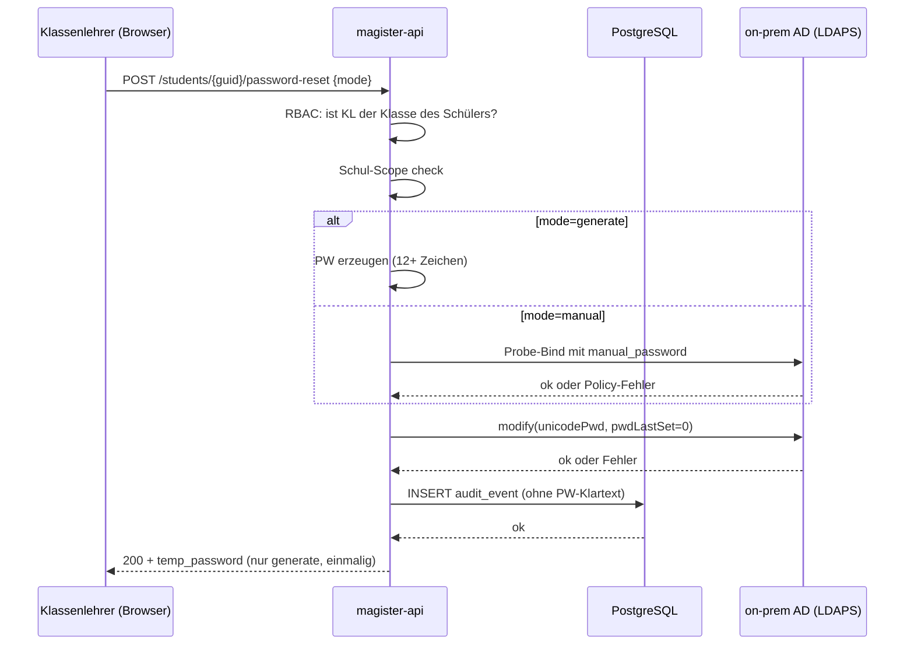

# Magister · SPEC

> **Magister** — User & class management for schools
> Part of **Schola Levis** by **Vita Brevis**

## 1. Vision & Ziele

Magister stellt eine sichere, auditierbare und mehrsprachige Web-Anwendung bereit, mit der Schweizer Schulen die User- und Klassenverwaltung gegen ihr bestehendes Active Directory abbilden. Im Zentrum steht der Klassenlehrer-Workflow: Klassen führen, Schüler:innen zuweisen, Passwörter zurücksetzen — ohne dass die Schul-IT für jeden Reset eingebunden werden muss.

## 2. Scope (M1)

**In Scope:**
- Auflistung der AD-User (Lehrer + Schüler) pro Schule
- Klassifizierung von AD-Lehrern als Klassenlehrer (mit Sub-Rolle: Haupt-KL, Co-KL, Stellvertretung)
- Definition von Schulklassen (Magister-DB als Master)
- Zuweisung von Klassenlehrer:innen und Schüler:innen zu Klassen
- Passwort-Reset für Schüler:innen durch deren Klassenlehrer (ldap3 → on-prem AD)
- OIDC-Login gegen Entra ID inkl. Bootstrap-Admin-Mechanik
- RBAC: Admin · Schulleitung · Klassenlehrer
- Vollständiges CRUD-Audit-Logging in DB
- Mehrsprachige UI: Deutsch (Default), Französisch, Italienisch, Englisch

**Non-Goals (explizit nicht in M1):**
- User-Anlage / -Löschung im AD (nur Reset + Enable/Disable in M2+)
- Eltern-Zugänge / -Briefe (M3)
- Stundenpläne, Notenverwaltung, Absenzen
- CSV-Imports aus Drittsystemen (M3)
- Mehrere Schulträger pro Instanz (eine Instanz = ein Schulträger)
- Telemetrie / Phone-Home (Zero-Phone-Home Policy)

## 3. Begriffe

| Begriff | Bedeutung |
|---------|-----------|
| Schulträger | Träger einer oder mehrerer Schulen (Gemeinde, Bezirk). Eine Magister-Instanz pro Schulträger. |
| Schule | First-Class-Entität. RBAC und Datenscope basieren auf der Schule. |
| Klassenlehrer (KL) | Lehrperson mit Hauptverantwortung für eine Klasse. Mehrere KL pro Klasse zulässig. |
| objectGUID | Stabile, immutable AD-Referenz auf einen User. Wird in Magister-DB als FK gespeichert. |
| Schulträger-Admin | Tech-Admin der Magister-Instanz. Sieht alle Schulen. |

## 4. User-Stories (M1)

### US-1 · AD-User Listing

> Als **Klassenlehrer** möchte ich eine Liste der Schüler:innen meiner Klasse(n) sehen, damit ich Aktionen (Reset, Zuweisung) gezielt ausführen kann.

**Akzeptanzkriterien:**
- Liste zeigt nur User der Schulen, in denen der KL eine Rolle hat (Schul-Scope)
- Daten kommen aus `ad_user_cache` (periodisch synchronisiert; "zuletzt synchronisiert"-Timestamp sichtbar)
- Bei AD-Ausfall: Banner "AD nicht erreichbar — Daten sind X Minuten alt", Listing read-only
- Filter: Klasse, Rolle (Lehrer/Schüler), Status (aktiv/deaktiviert), Suche (Name, UPN)
- Pagination (Default 50/Seite)

### US-2 · Klassenlehrer-Klassifizierung

> Als **Schulleitung** möchte ich eine Lehrperson zur:m Klassenlehrer:in einer Klasse machen können, mit Sub-Rolle (haupt/co/stellvertretung) und Zeitfenster.

**Akzeptanzkriterien:**
- Endpoint `POST /classes/{id}/teachers` mit `{ad_object_guid, role, valid_from, valid_to?}`
- Mehrere KL pro Klasse zulässig
- Gleichzeitig laufende Stellvertretung möglich (überlappendes valid_from/valid_to)
- Audit-Event `class_teacher_assigned` mit allen Feldern
- UI: Schulleitung-View "Klasse bearbeiten" mit KL-Liste + Add/Remove

### US-3 · Schulklassen-Definition

> Als **Schulleitung** möchte ich Klassen meiner Schule anlegen, umbenennen und archivieren können.

**Akzeptanzkriterien:**
- CRUD-Endpoints `/classes` mit `school_id` aus Session-Scope (kein cross-school write)
- Felder: `name` (z.B. "4a"), `kuerzel` optional, `jahrgangsstufe`, `status` (active/archived)
- Klassen sind "lebendig" — kein Schuljahres-Klon. Audit-Events halten Historie.
- Soft-Delete (archivieren), nicht hard-delete

### US-4 · Klassen-Zuweisung Schüler & Lehrer

> Als **Klassenlehrer** möchte ich Schüler:innen meiner Klasse hinzufügen und entfernen können.

**Akzeptanzkriterien:**
- Endpoints `POST/DELETE /classes/{id}/students` mit `ad_object_guid`
- KL kann nur seine eigenen Klassen mutieren (RBAC + Schul-Scope)
- Mid-year Wechsel: Schüler kann gleichzeitig in mehreren Klassen sein nur wenn `valid_from`/`valid_to` non-overlapping sind (Validation)
- Audit-Events `student_added_to_class` / `student_removed_from_class`

### US-5 · Schüler-Passwort-Reset durch KL

> Als **Klassenlehrer** möchte ich für meine Schüler:innen ein Passwort zurücksetzen können, ohne die IT zu kontaktieren.

**Akzeptanzkriterien:**
- Endpoint `POST /students/{ad_object_guid}/password-reset` mit Body `{mode: "generate"|"manual", manual_password?, force_change?}`
- KL kann nur Schüler:innen seiner eigenen Klassen resetten (RBAC + Schul-Scope)
- **Generate-Mode:** Magister erzeugt Temp-PW (≥ 12 Zeichen, 3 von 4 Charset-Klassen → erfüllt AD-Default-Policy), zeigt es einmalig im UI, schreibt es via ldap3 in `unicodePwd` und setzt `pwdLastSet=0` (Forced Change at next logon)
- **Manual-Mode:** KL gibt Wunsch-PW ein. Magister validiert gegen AD-Policy (Probe-Bind), bei Verletzung hart abgelehnt. Bei Erfolg wie Generate-Mode; `force_change=true` als Default (KL kann ausschalten)
- Audit-Event `student_password_reset` mit `{actor_upn, target_object_guid, mode, force_change, ip, ts, request_id}` — **Klartext-PW wird niemals geloggt**
- AD-Operation muss erfolgreich sein, sonst Rollback und User-Fehlermeldung in der Sprache des Lehrers

## 5. Datenmodell-Skizze

```
schools             (id, name, kuerzel, scope_short, created_at)
classes             (id, school_id FK, name, kuerzel, jahrgangsstufe, status, created_at, updated_at)
class_memberships   (id, class_id FK, ad_object_guid, valid_from, valid_to NULL, created_by, created_at)
class_teacher_roles (id, class_id FK, ad_object_guid, role: 'haupt'|'co'|'stellvertretung', valid_from, valid_to NULL, created_by, created_at)
ad_user_cache       (ad_object_guid PK, school_id FK, upn, given_name, surname, mail, kind: 'teacher'|'student'|'admin', enabled, last_sync_at)
role_assignments    (id, ad_object_guid, school_id FK NULL, role: 'admin'|'schulleitung', granted_by, granted_at, revoked_at NULL)
audit_events        (id, ts, actor_upn, actor_object_guid, action, target_kind, target_id, school_id, ip, request_id, payload JSONB)
sessions            (id, ad_object_guid, oidc_subject, expires_at, last_seen_at, ip, user_agent)
```

KL-Rolle = Eintrag in `class_teacher_roles`. Admin/Schulleitung = Eintrag in `role_assignments` (Admin mit `school_id=NULL`, Schulleitung mit `school_id` gesetzt). Schul-Scope-Filter wird in jeder Query auf `school_id` durchgesetzt.

## 6. PW-Reset Flow



## 7. Edge Cases

- **Co-Klassenlehrer:** Mehrere `class_teacher_roles` pro Klasse, alle gleichberechtigt im RBAC.
- **Stellvertretung:** Eintrag mit `role='stellvertretung'` und `valid_to`. RBAC behandelt ihn wie Haupt-KL für die Dauer.
- **Mid-year Klassenwechsel:** Schüler bekommt neuen `class_memberships`-Eintrag mit `valid_from=heute`, alter Eintrag bekommt `valid_to=heute-1`. Beide bleiben für Audit erhalten.
- **AD-Account deaktiviert:** `ad_user_cache.enabled=false` blockiert Reset-Aktionen mit klarer Meldung.
- **Namensgleichheit:** UPN ist unique in AD und damit in Magister; Anzeige "Vorname Nachname (UPN)" disambiguiert.
- **AD weg:** Listing read-only aus Cache, alle Schreib-Operationen disabled mit Banner. Konfigurierte DC-Liste wird der Reihe nach versucht (ldap3 ServerPool, Strategy=FIRST).
- **Lehrer in mehreren Klassen / Schulen:** Mehrere `class_teacher_roles` und ggf. mehrere `role_assignments` pro Schule. RBAC-Check vereinigt die Berechtigungen.
- **Bootstrap:** UPN aus `MAGISTER_BOOTSTRAP_ADMINS` env erhält bei erstem OIDC-Login `role_assignments(role='admin', school_id=NULL)`. Var kann danach entfernt werden.

## 8. Compliance (DSG / revDSG)

- **Verarbeitete Daten:** UPN, Name, E-Mail, Klassenzugehörigkeit, Audit-Events. Keine Geburtsdaten / Adressen / Diagnosen.
- **Verarbeitungszweck:** Schulorganisation; Rechtsgrundlage: Bildungsauftrag der Schulträger.
- **Aufbewahrungsfristen (fest):**
  - Audit-Events: 3 Jahre rolling
  - Soft-deleted User-Records (z.B. nach Schulaustritt): 10 Jahre
  - Sessions: 30 Tage nach `last_seen_at`
- **Datenexport für Betroffenenauskunft:** geplant in M2 (CLI + UI).
- **Telemetrie:** **Zero Phone-Home**. Keine externen Datensender; Logs bleiben on-prem.
- **DSFA-Empfehlung:** vom Schulträger durchzuführen (Magister liefert Datenkategorien + Verarbeitungszweck-Doku).
- **Audit-Logging:** Alle CRUD-Mutationen an Personen-, Klassen-, Rollen-Daten als strukturiertes Event in DB. `audit_events.payload` ist column-level via `pgcrypto` encrypted-at-rest. Read-only für alle ausser DB-Admin.
- **Operations & SLA:** Updates und Backups werden durch Vita Brevis Operations betrieben; technische und rechtliche Details werden im SLA-Vertrag zwischen Vita Brevis und Schulträger geregelt.

## 9. Decisions Log

| Datum | Thema | Entscheid |
|-------|-------|-----------|
| 2026-04-30 | PW-Reset-Variante | Lehrer wählt pro Reset zwischen `generate` (Magister erzeugt Temp-PW + Forced Change) und `manual` (Lehrer gibt Wunsch-PW ein, Forced Change als Default an, abschaltbar). |
| 2026-04-30 | Vita-Brevis-Ops-Zugang | Operations und SSH/Ansible-Pfad werden separat im SLA-Vertrag zwischen Vita Brevis und Schulträger geregelt — nicht im SPEC. |
| 2026-04-30 | Aufbewahrungsfristen | Defaults (3 Jahre Audit, 10 Jahre soft-delete, 30 Tage Sessions) sind fix; keine pro-Schulträger-Konfiguration. |
| 2026-04-30 | Audit-Listing-UI | Verschoben auf M2 (siehe `ROADMAP.md`). |
