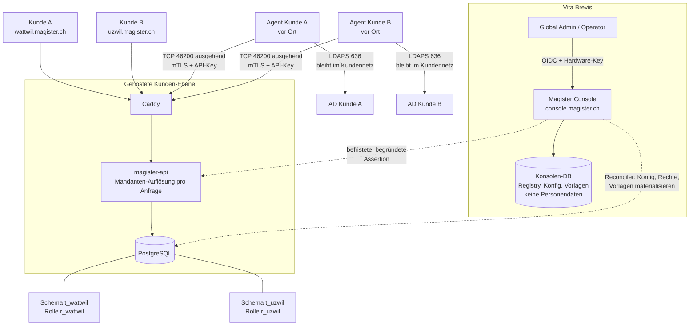

# Mandantenfähigkeit — Planung

> Umsetzungsplan zu [ADR-0013](../adr/0013-mandantenfaehigkeit-control-plane.md)
> (Mandantenfähigkeit), [ADR-0014](../adr/0014-ad-connector-agent.md)
> (AD-Connector-Agent), [ADR-0015](../adr/0015-authentisierungs-haertung.md)
> (Authentisierungs-Härtung) und
> [ADR-0016](../adr/0016-sicherung-wiederherstellung-export.md) (Sicherung,
> Wiederherstellung, Export).
> Status: **Planung, nichts implementiert.** Mockup der Oberfläche:
> `docs/mockups/multitenancy-console/`.

## 1 · Ziel

Eine gehostete Magister-Plattform, auf der mehrere Kunden (Schulträger und
Firmen) betrieben werden. Vita Brevis erfasst Kunden und pflegt deren
Systemeinstellungen zentral; Kunden melden sich unter einem eigenen Pfad an und
sehen von der Plattform nichts. Die Trennung ist auf Datenbankebene erzwungen.

**Kein Sonderweg für Einzelinstallationen.** Jede Installation ist
mandantenfähig; eine Installation beim Kunden hat einfach genau einen Mandanten
— gleiche Auflösung, gleicher Agent, gleiche Ports, gleicher Code (ADR-0013 D8).
On-prem bleibt gebraucht und bekommt keine eingeschränkte Variante.

## 2 · Begriffe

| Begriff | Bedeutung |
|---|---|
| Kunde / Mandant | Ein Schulträger oder eine Firma. Eigenes Schema, eigene DB-Rolle, eigener Pfad. |
| Standort | Bisherige `schools`-Zeile. Bleibt die Scope-Einheit *innerhalb* eines Kunden. |
| Konsole / Control Plane | Global-Admin-Oberfläche plus deren API und Datenbank. Weiterentwicklung von `cockpit/`. |
| Kunden-Ebene / Data Plane | Die bestehende `magister-api` plus `magister-web`, pro Anfrage auf genau einen Kunden aufgelöst. |
| Global Admin | Vita-Brevis-Rolle: Kunden, Systemeinstellungen, Rechte, Vorlagen. |
| Global Operator | Vita-Brevis-Rolle: alle Kunden sehen und bedienen, keine Plattformkonfiguration. |
| Kunden-Admin | Bisherige Rolle `admin`. Verliert Systemeinstellungen und die Rechte-Matrix. |
| Connector-Agent | Kleiner Dienst im Kundennetz, der ausgehend zur Plattform telefoniert und dort die AD-Aufträge abholt. Einziger Prozess mit AD-Zugang. |

## 3 · Zielbild

Die Agenten bauen ihre Verbindung selbst auf; die Plattform öffnet nie eine
Verbindung ins Kundennetz.

Drei Listener mit drei Erreichbarkeiten:

| Listener | Adresse | Hostname | Wer | Aus dem Internet |
|---|---|---|---|---|
| Kundenoberfläche | `0.0.0.0:443` | `<kunde>.magister.ch` | Lehr- und Leitungspersonen, MFA über Entra | erreichbar, WAF davor |
| Konsole | `10.0.0.5:4444` | `console.magister.ch` | Global Admin, Global Operator | **nicht geroutet** |
| Connector | `0.0.0.0:46200` | `connect.magister.ch` | Connector-Agenten, nur mit Client-Zertifikat | erreichbar |

Das Usermanagement des Kunden gehört ins Internet, das Global Management nicht.
Quell-IP-Regeln macht die Fortigate mit der WAF, nicht Magister.

Die gestrichelten Pfeile laufen **nie** im Anfrage-Pfad eines Kunden: die
Konsole schreibt in die Kundenschemas, aber kein Kunden-Request liest die
Konsolen-DB.

## 4 · Datenmodell

### 4.1 Konsolen-Datenbank (neu)

| Tabelle | Inhalt |
|---|---|
| `tenants` | `id`, `slug`, `name`, `customer_no`, `status` (`provisioning`/`active`/`suspended`/`offboarding`), `profile` (`school`/`company`/`neutral`), `path_prefix`, `custom_domain`, `isolation_mode` (`schema`/`database`/`cluster`), `dsn_ref`, `schema_name`, `db_role`, `schema_version`, `created_at` |
| `tenant_settings` | Autoritative Fassung dessen, was heute `app_settings` ist — **pro Kunde**, ohne `CHECK id = 1`. Secrets als Envelope-Referenz, nicht als Wert. |
| `tenant_secrets` | Pro Kunde: Datenschlüssel (Audit), AD-Bind-Passwort, OIDC-Client-Secret. Envelope-verschlüsselt mit dem Plattform-Schlüssel. |
| `tenant_entitlements` | Edition, Modul-Freischaltung, Benutzer-Limit, Lastgrenzen. |
| `global_roles` / `global_role_capabilities` | Globale Rechte-Matrix, pro Profil ein Standard-Set. |
| `global_document_templates` / `global_group_templates` | Globale Vorlagen mit `version` und `tenant_may_override`. |
| `rollouts` | Ein Auftrag je Ausrollung (Konfig, Rechte, Vorlagen, Migration) mit Status pro Kunde. |
| `provisioning_jobs` | Schritte beim Anlegen eines Kunden, wiederaufnehmbar. |
| `platform_operators` / `platform_role_assignments` | Global Admin / Global Operator. |
| `operator_access_grants` | Jeder Zugriff im Kundenkontext: Operator, Kunde, Grund/Ticket, Beginn, Ende. |
| `platform_audit_events` | Plattform-Audit, getrennt vom Kunden-Audit. |
| `connector_agents` | Pro Kunde ein bis mehrere Agenten: Name, Status, Version, letzter Kontakt, SPKI-Fingerprint des Client-Zertifikats, Ablaufdatum, argon2id-Hash des API-Keys, Widerruf-Flag. |
| `connector_enrollments` | Einmal-Token für die Anmeldung eines Agenten: Kunde, Hash, Ablauf, eingelöst-am, ausgestellt-von. |
| `connector_jobs` | Auftragswarteschlange: Kunde, Methode (aus der Allowlist), Nutzlast, Status, TTL, Ergebnis, HMAC. Nutzlasten mit Passwörtern werden nach Abschluss sofort gelöscht. |
| `platform_ca` | CA-Zustand: die zwei Intermediates (Connector, Operator), Seriennummern, Widerrufs-Flags (intern, kein CRL-Vertrieb). |
| `tenant_backups` | Eine Zeile pro Sicherung: Kunde, Zeitpunkt, Art (`daily`/`monthly`/`pre_migration`/`manual`), Ablage, Grösse, Prüfsumme, Schlüssel-Id, `verified_at`. |
| `tenant_backup_policy` | Aufbewahrung, Zeitfenster, Ziel-Ablagen, RPO/RTO pro Kunde — Vertragswerte. |
| `restore_jobs` / `export_jobs` | Wiederherstellungen (Quelle, Ziel-Schema, Freigaben) und Exporte (Umfang, Prüfsumme, Ablauf des Download-Links). |

### 4.2 Kundenschema (Änderungen)

- `app_settings` bleibt als **materialisierte Kopie** bestehen; neue Spalten
  `managed_by` (`platform`) und `source_version`. Schreibzugriff nur für den
  Reconciler (Rolle `r_reconciler`, nicht `r_<slug>`).
- `roles` / `role_capabilities` dito: Kopie, schreibgeschützt für den Kunden.
- `document_templates` / `group_templates`: neue Spalten `origin`
  (`global`/`tenant`), `global_template_id`, `global_version`,
  `tenant_may_override`. Auflösung: **Kunde+Standort → Kunde → global →
  eingebaut**.
- `sessions`: neue Spalte `tenant_id` (Gegenprobe zum aufgelösten Kunden) und
  `operator_grant_id` für Operator-Sitzungen.
- `audit_events`: die Ereignisse `settings_pushed`, `templates_pushed`,
  `rights_pushed`, `operator_access_started`, `operator_access_ended` sind für
  den Kunden lesbar — Transparenz ist Teil der Zusage.
- `role_assignments` bleibt unverändert beim Kunden (siehe offener Entscheid E2).
- `local_admins`: neue Spalten `totp_secret_enc`, `totp_confirmed_at`,
  `totp_last_step`, `recovery_codes`, dazu `totp_reset_at` / `totp_reset_by` und
  `mfa_suspended_until` für die befristete Aufhebung (ADR-0015 D2). Gehostet ist
  dieser Anmeldeweg ganz abgeschaltet; on-prem ist er der Notzugang.
- `app_settings`: `ad_login_enabled` und `ad_login_group` fallen weg (ADR-0015 D3).

## 5 · Anfrage-Pfad

1. Caddy nimmt `*.magister.ch` auf einem Wildcard-Zertifikat an und gibt den
   `Host` als `X-Forwarded-Host` weiter.
2. Middleware löst den Hostnamen gegen einen Registry-Cache auf: unbekannt →
   404, `suspended` → eigene Seite, Stand ≠ Kopf-Version → 503 Wartung. Bei
   einer Installation mit genau einem Mandanten trägt dessen Registry-Zeile den
   konfigurierten Hostnamen — dieselbe Auflösung, nur eine Zeile.
3. Aus dem Registry-Eintrag (DSN + Schema) kommt die Engine; pro Transaktion
   `SET LOCAL ROLE r_<slug>` und `SET LOCAL search_path = t_<slug>`.
4. Zusicherung: `current_user` passt zum Kunden der Anfrage, sonst Abbruch.
5. Session-Cookie wird gegen `sessions.tenant_id` geprüft; eine Session von
   Kunde A auf der Subdomain von Kunde B → 401. Weil jeder Kunde eine eigene
   Origin hat, trennt der Browser Cookies und Speicher ohnehin schon.
6. Ab hier ist der bestehende Code unverändert — inklusive `school_id`-Filter,
   der weiterhin *innerhalb* eines Kunden gilt.

Die `SET LOCAL`-Variante erlaubt **einen** gemeinsamen Verbindungs-Pool: beide
Einstellungen enden mit der Transaktion, ein Pool kann nichts weitertragen.

Neuer Kunde heisst betrieblich: ein DNS-Eintrag, eine Registry-Zeile, ein
Entra-Redirect-URI. Das Wildcard-Zertifikat deckt die Subdomain ohne weiteres
Zutun ab.

## 6 · Was zieht wohin

| Heute | Künftig |
|---|---|
| `admin_settings.py` (`/admin/app-settings`) | **Konsole.** Aus der Kunden-API entfernt. |
| `admin_rbac.py` (`/admin/rbac`) | **Konsole.** Aus der Kunden-API entfernt. |
| `admin_modules.py` | **Konsole** (Freischaltung); `/me/modules` bleibt lesend beim Kunden. |
| `admin_system.py`, `admin_maintenance.py`, `services/web_tls.py` | **Konsole / Plattform-Betrieb.** |
| `admin_local_admin.py` | **Entfällt** in gehosteter Betriebsart (kein lokales Notkonto beim Kunden). |
| `admin_document_templates.py`, `group_templates.py` | Autorenstelle **Konsole**; Kunde liest, und überschreibt nur wo erlaubt. |
| `admin_roles.py` (Rollen*zuweisung* an Personen) | **Bleibt beim Kunden** — siehe E2. |
| `admin_sync.py` (Sync auslösen) | Bleibt beim Kunden; Intervall und Ziele kommen global. |
| `POST /auth/login/ad` | **Entfällt** (ADR-0015 D3) — der Code wird entfernt, nicht abgeschaltet. |
| `POST /auth/login/local` | Bleibt on-prem, zweistufig mit TOTP; gehostet abgeschaltet. |
| `routers/ad_rpc.py` (eingehendes AD-RPC) | Bleibt für den Monolith und den Container-Split; gehostet tritt der Connector-Rücken daneben (ADR-0014). |
| — neu — | `/connector/*` (Anmeldung, Auftragsabruf, Ergebnis, Zertifikatserneuerung): eigener Listener auf `0.0.0.0:46200`, nur mit Client-Zertifikat, nicht Teil der Kunden-API. |
| — neu — | `/auth/local/totp/*` (Einrichtung, Prüfung) beim Kunden; die vier Reset-Eingriffe liegen in der Konsole beziehungsweise im CLI. |
| — neu — | `magister-cli local-admin totp-reset` (`--new-recovery-codes`, `--disable`) für On-prem-Installationen ohne Konsole. |
| Alles Fachliche (Benutzer, Klassen, Abteilungen, Geräte, Importe, Briefe, Auswertungen, Audit) | Bleibt beim Kunden. |

## 7 · Phasen

### Phase 0 — Authentisierungs-Härtung ← **hier fangen wir an**

Braucht keine Mandantenfähigkeit und verkleinert die Angriffsfläche, bevor
irgendetwas gehostet wird. Läuft allein, nicht parallel zu Phase 1 — beide
fassen denselben Auth- und DB-Bereich an. Referenz: ADR-0015.

- ✅ **AD-Login entfernen, Release N.** Endpunkt `/auth/login/ad`,
  `complete_ad_login`, `AdClient.authenticate` samt Hilfsfunktionen,
  `authenticate` aus der RPC-Allowlist, das Settings-Feld in Service, Schema und
  Config, Formular und Einstellungs-Abschnitt im Frontend, 44 i18n-Schlüssel in
  vier Sprachen. Neu: `Settings.reject_removed_env()` bricht den Start ab, wenn
  `MAGISTER_AD_LOGIN_ENABLED` noch auf einen wahren Wert gesetzt ist, und warnt
  bei einem veralteten `=false`. Zwei Regressionstests halten es fest: keine
  Route unter `/auth/login/ad`, und `authenticate` weder in `ALLOWED_METHODS`
  noch auf `AdClient`/`AdRpcClient`. Die Spalten `ad_login_enabled` /
  `ad_login_group` bleiben als deprecated stehen, damit dieses Release ohne
  Schemaänderung zurückrollbar ist.
- **AD-Login, Release N+1:** Alembic entfernt die beiden Spalten (Rückbau von
  `0019_ad_login`).
- ✅ **TOTP für lokale Konten**, verpflichtend. Der Login ist zweistufig:
  das Passwort ergibt nur einen signierten, fünf Minuten gültigen Nachweis plus
  die nächste Stufe (`totp` oder erzwungene Einrichtung) — **keine Sitzung**.
  Damit gibt es keinen halb privilegierten Zustand, den jeder andere Endpunkt
  gegen prüfen müsste. Zehn Wiederherstellungscodes, argon2id-gehasht,
  einmalig, einmal angezeigt. QR als serverseitiges Inline-SVG (`segno`), CSP
  unverändert. Migration `0044_local_admin_totp`.
- ✅ **Vier Reset-Eingriffe** (ADR-0015 D2): zurücksetzen, neue
  Wiederherstellungscodes, Konto deaktivieren, MFA-Pflicht befristet (24 h,
  selbst ablaufend) aufheben — als Konsolen-API unter
  `/admin/local-admin/mfa*` **und** als `magister-cli local-admin totp-reset`
  für Installationen ohne Konsole. Jeder Eingriff mit eigenem,
  kundensichtbarem Audit-Ereignis. Das Notkonto bleibt ein Singleton (E12).
  Runbook: [`docs/runbooks/local-admin-mfa.md`](../runbooks/local-admin-mfa.md).
- ✅ **Eigener Fehlversuchszähler für den zweiten Faktor**
  (`local_admins.mfa_failed_count`). Nötig, weil ein korrektes Passwort
  `failed_login_count` zurücksetzt — dort mitzuzählen hätte jedem, der das
  Passwort hat, unbegrenzte Versuche am zweiten Faktor gelassen. Zwei Budgets,
  eine gemeinsame 15-Minuten-Sperre.
- **Plattform-CA anlegen** (E9): Offline-Root auf zwei verschlüsselten
  USB-Sticks im Tresor, Passphrase getrennt bei zwei Verwahrern, zwei
  Intermediates im Betrieb, dazu das dokumentierte Verfahren für Ausstellung,
  Erneuerung und Verlust. Verwahrer und Ablage sind entschieden; die Zeremonie
  selbst ist Handarbeit an einem Rechner ohne Netz —
  [`scripts/platform-ca-ceremony.sh`](../../scripts/platform-ca-ceremony.sh)
  führt sie schrittweise durch und schreibt das Protokoll mit.
  Runbook: [`docs/runbooks/platform-ca.md`](../runbooks/platform-ca.md).
- **Konsolen-Listener** vorbereiten: eigener Site-Block, Bindung an die interne
  Adresse, Client-Zertifikat gegen die private CA, Marker-Riegel in der
  Anwendung. (Die Konsole selbst kommt in Phase 2 — Listener und CA sind die
  Vorarbeit, die der Connector in Phase 2a ebenfalls braucht.)
- **Abnahme:** Kein Anmeldeweg ohne zweiten Faktor; ein Contract-Test verweigert
  jede Route unter `/auth/login/ad`; ein lokales Konto ohne bestätigtes TOTP
  erreicht ausschliesslich die Einrichtungsseite; ein zurückgesetztes Konto
  landet beim nächsten Anmelden zwingend in der Einrichtung und bekommt dabei
  kein Geheimnis angezeigt; eine aufgehobene MFA-Pflicht greift nach 24 Stunden
  von selbst wieder; der Konsolen-Listener ist auf der öffentlichen Adresse
  nicht gebunden und lehnt ohne Client-Zertifikat den Handshake ab.

### Phase 1 — Mandanten-Abstraktion mit genau einem Kunden ✅

Der wichtigste De-Risking-Schritt: die ganze Mechanik einbauen, **ohne**
Verhaltensänderung.

- ✅ **Registry** (`magister_api/tenancy/registry.py`) aus `MAGISTER_TENANTS`,
  noch ohne Konsole. Die Validierung ist die Sicherheitsgrenze für Bezeichner,
  weil `SET` keine Bind-Parameter nimmt; ab zwei Mandanten erzwingt sie
  ausserdem eigene Anmelderolle, eigenen Hostnamen und eigenes Schema pro Kunde.
- ✅ **Auflösungs-Middleware** (`tenancy/middleware.py`): unbekannter Hostname →
  404 (nicht 400 — eine unterscheidende Antwort verrät die Kundenliste), nicht
  aktiv → 503, Schema-Stand ≠ Kopf-Version → 503 Wartung.
- ✅ **Engine-Registry** (`tenancy/engines.py`) je DSN, **ein Pool pro Kunde**.
- ✅ **Zusicherung** (`tenancy/scope.py`): `search_path` setzen, dann `session_user`,
  `current_user` und `search_path` gegen die Datenbank prüfen, bevor der erste
  Query läuft.
- ✅ **Ein einziger Eingriff im Anwendungscode:** `db.get_session` nimmt jetzt
  den Request und liefert eine mandantengebundene Transaktion. Kein Router,
  kein Service, kein Repository wurde angefasst — alle 40 Aufrufstellen hängen
  an `Depends(get_session)`.
- ✅ **Alembic pro Schema** (`version_table_schema` + `search_path`), die 44
  bestehenden Migrationen unverändert. Kopf-Version als Konstante in
  `tenancy/version.py`, gegen den echten Alembic-Kopf getestet.
- ✅ **Migrations-Runner** `magister-cli tenants migrate`: Dump pro Kunde
  **vor** der Migration (ADR-0016 D6), Kanarienvogel zuerst, Abbruch bei
  Fehler, `--keep-going` nur für die Nicht-Kanarienvögel.
- ✅ **Schema-Umzug** `public` → `t_default`:
  `scripts/schema-move-to-tenant.sql`, mit Vorprüfungen, Eigentumsübergabe und
  Nachprüfung, dass in `public` keine Anwendungstabelle zurückbleibt.
- ✅ Kein `MAGISTER_MULTITENANT`-Schalter: eine Installation mit einem Mandanten
  löst über den konfigurierten Hostnamen seiner Registry-Zeile auf — dieselbe
  Middleware, dieselben Abfragen (E4, ADR-0013 D8). Ohne `MAGISTER_TENANTS`
  entsteht die Zeile aus `MAGISTER_DATABASE_URL`.
- ✅ **Abnahme:** alle 856 bestehenden Tests grün und unverändert; ein
  Contract-Test gegen echtes Postgres beweist, dass eine Mandantenrolle das
  Nachbarschema nicht lesen, nicht in dessen Rolle wechseln und es nicht einmal
  im Katalog sehen kann (`tests/integration/test_tenant_isolation.py`); ein
  zweiter Test führt eine echte HTTP-Anfrage ohne jede Überschreibung durch die
  ganze Kette (`tests/integration/test_tenant_request_path.py`).

**Drei Dinge, die beim Bauen anders herauskamen als geplant** — alle drei sind
gemessen, nicht überlegt:

1. **`SET LOCAL ROLE` ist keine Grenze gegen SQL-Injection.** Postgres prüft
   `SET ROLE` gegen den Sitzungsbenutzer; eine gemeinsame Anmelderolle kann
   aus jedem Mandanten in jeden anderen wechseln. Folge: eigene Anmelderolle
   pro Kunde, ein Pool pro Kunde. Siehe die Korrektur in ADR-0013 D1.
2. **Migrieren als Superuser macht das Schema für den Kunden unbenutzbar.**
   Die Tabellen gehören dann dem Superuser, und die Mandantenrolle bekommt
   beim ersten Query „permission denied for table". Der Runner migriert
   deshalb mit der Anmelderolle des Kunden.
3. **Das Erweiterungsschema muss auf dem `search_path` stehen**, sonst findet
   der Audit-Dienst `pgp_sym_encrypt` nicht — aber als *zweiter* Eintrag und
   in einem Schema ohne Anwendungstabellen, sonst könnte eine fehlende Tabelle
   still darauf zurückfallen. Der Umzug prüft das nach.

### Phase 2 — Konsole und Bereitstellung (API fertig, Oberfläche und OIDC offen)

- ✅ **Konsolen-DB** mit `tenants` und `provisioning_jobs`
  (`cockpit/api/alembic/versions/0004_tenants.py`). Kein DSN und kein Passwort
  in der Konsole: `dsn_ref` ist ein **Verweis**, den die Datenebene aus ihrem
  eigenen Geheimnisspeicher auflöst. Die Konsole kann Sitzungen in jeden Kunden
  ausstellen — ein Geheimnis, das dort nicht liegt, kann dort nicht gestohlen
  werden.
- ✅ **Bereitstellungs-Auftrag** in fünf Schritten (`create_role`,
  `create_schema`, `migrate`, `data_key`, `activate`), jeder idempotent, mit
  Protokoll je Schritt. `POST /api/tenants` legt an und fährt den Auftrag;
  `POST /api/tenants/{id}/provisioning/resume` macht **ab der Abbruchstelle**
  weiter, nicht von vorn.
- ✅ **Kundenliste und -Detail** (`GET /api/tenants`, `GET /api/tenants/{id}`),
  **Sperren und Entsperren** (`suspend` mit Pflicht-Begründung, `unsuspend`).
  Sperren ist eine Aussage über die Bedienung, nicht über den Bestand: Rolle,
  Schema und Daten bleiben stehen, sonst wäre Entsperren eine Wiederherstellung.
- ✅ **Registry-Auslieferung an die Datenebene** (`GET /api/tenants/registry`)
  plus Abholer in `magister_api/tenancy/console_registry.py`: Abruf beim Start
  und danach im Hintergrund, im heissen Pfad nur der Zwischenspeicher. Ist die
  Konsole nicht erreichbar oder liefert sie Unbrauchbares, **bleibt der letzte
  gute Stand in Kraft** — eine Störung in der Verwaltung ist kein Ausfall des
  Betriebs. Ein leeres Ergebnis ersetzt nichts, sonst setzte ein Fehler in der
  Konsole alle Kunden auf 404.
- ✅ **Abnahme:** zwei Kunden auf einer Installation, der Griff ins
  Nachbarschema scheitert an Postgres und nicht an einem Filter; ein
  abgebrochener Auftrag lässt den Kunden auf `provisioning`, das Protokoll
  nennt den Schritt und `next_step` zeigt, wo es weitergeht. 56 Tests im
  Cockpit, davon der komplette Auftrag samt Alembic gegen echtes Postgres.
- ⏳ **Offen: Anmeldung via OIDC mit Hardware-Schlüssel** (ADR-0013 D2). Braucht
  eine App-Registrierung im Entra-Tenant von Vita Brevis (Client-ID, Secret,
  Redirect-URI) — deshalb nicht mitgebaut, sondern als eigener Schritt. Bis
  dahin gilt die bestehende Anmeldung (Bootstrap-Token bzw. Service-Token)
  hinter dem Konsolen-Listener mit Client-Zertifikat.
- ⏳ **Offen: die Oberfläche.** Die Endpunkte stehen, das Mockup steht; die
  React-Seiten fehlen.

**Zwei Fallstricke, die beim Bauen aufgefallen sind** — beide gemessen:

1. **`CREATE ROLE ... PASSWORD` nimmt keine Bind-Parameter.** Das Passwort
   müsste als Literal ins SQL — und stünde damit im Postgres-Log, sobald
   `log_statement = ddl` gesetzt ist, sowie in `pg_stat_activity`, solange die
   Anweisung läuft. Die Konsole schickt deshalb einen **vorberechneten
   SCRAM-SHA-256-Verifier**, wie `psql \password` es tut: was über die Leitung
   geht, lässt sich nicht in ein Passwort zurückrechnen. Dass die Ableitung
   stimmt, belegt ein Test, der sich mit dem Klartextpasswort tatsächlich
   anmeldet.
2. **`text()` liest `:` im Verifier als Bind-Parameter.** Der SCRAM-String
   enthält `4096:` — SQLAlchemy machte daraus einen Parameter und brach ab.
   Die Rollen-Anweisungen laufen deshalb über `exec_driver_sql`.

### Phase 2a — AD-Connector-Agent (Plattformseite steht, Agent folgt)

Blockiert den ersten gehosteten Kunden: ohne Agenten gibt es keinen
Passwort-Reset. Referenz: ADR-0014.

- ⏳ **Plattform-CA**: Verfahren und Skript stehen
  ([platform-ca.md](../runbooks/platform-ca.md)), die Zeremonie ist Handarbeit
  bei Vita Brevis. Der Code-Pfad der Ausstellung ist fertig und gegen eine
  eigens gebaute Test-CA geprüft: der Agent schickt nur einen **CSR**, der
  Subject kommt aus der Agent-Zeile und nicht aus dem CSR, ein RSA-Schlüssel
  unter 3072 Bit wird abgelehnt, das Zertifikat trägt ausschliesslich
  `clientAuth`.
- ✅ **Connector-Endpunkt** auf eigenem Listener `0.0.0.0:46200` mit
  `require_and_verify`, plus Abgleich von **SPKI-Fingerprint** und API-Key
  gegen dieselbe Agent-Zeile. Der Fingerprint geht über den öffentlichen
  Schlüssel, nicht über das Zertifikat — eine Erneuerung mit demselben
  Schlüssel löst die Bindung dann nicht. Kein Rückfall auf 443 (E11).
- ✅ **Zwei getrennte Marker** für die zwei Listener derselben Anwendung: der
  Management-Marker öffnet den Connector-Kanal nicht und umgekehrt. Gleiche
  Werte brechen den Start ab.
- ✅ **Anmeldung mit Einmal-Token**: 24 Stunden, genau einmal einlösbar, im
  Paket liegt kein weiteres Geheimnis. API-Key und HMAC-Schlüssel kommen genau
  einmal zurück; die Konsole speichert den API-Key nur als argon2id-Hash.
- ✅ **Auftragswarteschlange** mit der Allowlist aus `ad/rpc.py` — wörtlich,
  und ein Test hält die beiden Mengen zusammen. Auch ein Global Admin bekommt
  kein freies LDAP, kein PowerShell, kein Skript. Aufträge verfallen (ein Agent,
  der zehn Minuten weg war, soll kein Passwort mehr setzen), Nutzlasten mit
  Passwörtern werden nach Abschluss sofort gelöscht, und `payload_purged_at`
  zeigt, dass ein leeres Feld absichtlich leer ist.
- ✅ **Ergebnis-HMAC** über Auftrags-Id **und** Körper. Die Id gehört hinein,
  sonst liesse sich ein gültig signiertes Ergebnis auf einen anderen Auftrag
  umhängen.
- ✅ **Widerruf als Datenbank-Flag**, bei jeder Anfrage geprüft — keine CRL,
  kein OCSP. Ein gesperrter Kunde stoppt seinen Agenten mit.
- ⏳ **Offen: der Agent selbst** (Windows-MSI, `.deb`, OCI-Image),
  Paket-Download in der Konsole, automatische Zertifikatserneuerung,
  automatische Updates (E10), lokale OU-Allowlist und Gruppen-Denylist.
- ⏳ **Offen: die Warteschlange hinter `AdClient`** in der Datenebene als
  dritter Rücken (nach *direkt* und *eingehendem RPC*) — kein Aufrufer im
  Fachcode ändert sich.
- ⏳ **Offen: die vier Reset-Eingriffe in der Oberfläche** (Phase 0 hat sie im
  CLI).
- **Abnahme, bisher erfüllt:** ein Client-Zertifikat von Kunde A wird auf dem
  Kanal von Kunde B abgewiesen; ein Auftrag mit einer Methode ausserhalb der
  Allowlist wird plattformseitig verweigert; das Download-Paket enthält kein
  Geheimnis ausser dem Einmal-Token; ein widerrufener Agent kommt bei der
  nächsten Anfrage nicht mehr durch. **Noch offen** (braucht den Agenten): der
  Passwort-Reset über den Agenten, das 503-Banner bei stehendem Agenten, und
  „Agent stoppen beendet jeden Plattformzugriff auf das AD".

### Phase 2b — Sicherung, Wiederherstellung, Export

Ebenfalls Voraussetzung für den ersten gehosteten Kunden: ohne Restore-Weg pro
Kunde darf keine Fremddaten-Haltung starten. Referenz: ADR-0016.

- **Cluster-PITR** (WAL-Archivierung plus Basebackup) für „Datenbank kaputt".
- **Logische Sicherung pro Kunde** (`pg_dump --schema=t_<slug>`), mit `age`
  verschlüsselt, auf einen Share geschrieben, den das tägliche
  Unternehmens-Backup mitnimmt (E13). Magister schreibt, löscht aber nicht — ein
  Cron-Job auf dem Fileserver mit eigenem Konto entfernt Dumps, die älter als
  **10 Tage** sind (E14).
- **Wöchentliche Prüf-Wiederherstellung** in ein Wegwerf-Schema mit
  Prüfabfragen; Ergebnis pro Kunde in der Konsole.
- **Restore daneben, nie darüber**: neues Schema, Umschalten erst nach Freigabe
  durch eine zweite Person, altes Schema bleibt stehen.
- **Export** in offenen Formaten (CSV plus Manifest), zeitlich begrenzter
  Download, auditiert.
- **Offboarding-Ablauf** mit Karenzzeit, Crypto-Shredding des Kundenschlüssels
  und Löschung mit Fristablauf.
- **Aufbewahrung** 10 Tage, in der Konsole sichtbar, pro Kunde überschreibbar.
- **Einzelinstallationen**: derselbe Weg mit `n=1`; die bestehende Sidecar wird
  um Verschlüsselung, Prüf-Wiederherstellung und `magister-cli backup verify`
  erweitert, statt daneben etwas Eigenes zu bekommen.
- **Abnahme:** Ein Kunde wird aus einem Dump in ein Nebenschema
  wiederhergestellt, ohne dass ein anderer Kunde etwas merkt; ein absichtlich
  beschädigter Dump fällt in der wöchentlichen Prüfung auf; ein Export ist ohne
  Magister lesbar; nach dem Vernichten des Kundenschlüssels ist kein
  Audit-Payload mehr entschlüsselbar.

### Phase 3 — Systemeinstellungen und Rechte umziehen

- `tenant_settings` und globale Rechte-Matrix in der Konsole; Reconciler
  materialisiert ins Kundenschema mit Audit-Ereignis.
- `/admin/app-settings` und `/admin/rbac` aus der Kunden-API **entfernen**;
  Frontend-Menüpunkte entfallen.
- Neue Plattform-Capabilities, die keine Kundenrolle halten kann.
- **Abnahme:** Ein Contract-Test zählt die Routen der Kunden-API und schlägt
  fehl, sobald eine System- oder Rechte-Route dort wieder auftaucht.

### Phase 4 — Globale Vorlagen

- Globale Vorlagen mit Version und `tenant_may_override`; Rollout auf alle
  Kunden, ein Profil oder eine Auswahl.
- Auflösungskette im Renderer; Hinweis „neue globale Fassung verfügbar" beim
  Kunden mit eigener Fassung.
- **Abnahme:** Rollout ist idempotent; ein Kunde mit eigener Fassung bleibt
  unverändert; Ausfall der Konsole verhindert kein Drucken.

### Phase 5 — Kundenwahl und Operator-Zugriff

- Kundenwahl nach dem Login, Grund/Ticket pflichtig.
- Assertion → befristete Kunden-Session; Hinweisbalken auf beiden Seiten;
  kundensichtbare Zugriffsliste.
- **Abnahme:** Eine abgelaufene oder zweimal eingelöste Assertion wird
  abgewiesen; jeder Zugriff steht im Kunden-Audit.

### Phase 6 — Betrieb im Grossen

- Migrations-Wellen mit Kanarienvogel und Versions-Schranke.
- Lastgrenzen pro Kunde (Verbindungen, `statement_timeout`, gleichzeitige
  Aufträge, Anfragen pro Minute).
- AD-Sync-Fan-out pro Kunde, versetzt, mit isoliertem Fehlerverhalten.
- Umzug eines Kunden auf eine eigene Datenbank oder einen eigenen Cluster
  (nutzt den Restore-Weg aus Phase 2b).
- Connector-Flotte betreiben: Agent-Versionen, Zertifikatsablauf,
  Erneuerungsfehler und stehende Agenten überwachen und alarmieren.

## 8 · Neue harte Regeln (Ergänzung zu CLAUDE.md)

- **Niemals** eine DB-Verbindung benutzen, ohne dass die Mandanten-Auflösung
  Rolle und `search_path` für die Transaktion gesetzt hat.
- **Niemals** `SET ROLE` oder `SET search_path` ohne `LOCAL`.
- **Niemals** aus der Kunden-Ebene die Konsolen-Datenbank lesen oder schreiben.
- **Niemals** eine System- oder Rechte-Konfigurationsroute in der Kunden-API
  mounten.
- **Niemals** einen kundenübergreifenden Query ohne `# scope-bypass: <reason>`
  *und* Ausführung als Plattform-Rolle.
- **Immer** Personendaten eines Kunden nur im Kundenschema — die Konsolen-DB
  bleibt frei davon.
- **Immer** ein kundensichtbares Audit-Ereignis bei Operator-Zugriff und bei
  jedem Rollout in ein Kundenschema.
- **Niemals** einen Connector-Auftrag annehmen, dessen Methode nicht in der
  Allowlist steht — und niemals eine Auftragsart einführen, die beliebiges
  LDAP, PowerShell oder Skripte im Kundennetz ausführt.
- **Niemals** ein Geheimnis in ein herunterladbares Agent-Paket legen; der
  private Schlüssel entsteht auf dem Agenten.
- **Niemals** einen Connector-Kanal ohne *beide* Faktoren akzeptieren
  (Client-Zertifikat mit passendem Fingerprint **und** API-Key derselben Zeile).
- **Niemals** das Klartext-Passwort eines Verzeichnisbenutzers gegen AD binden.
  Einzige Ausnahme bleibt der Probe-Bind eines gerade selbst gesetzten
  Passworts (`probe_bind_as_user`).
- **Niemals** einen Anmeldeweg ohne zweiten Faktor einführen oder
  wiederherstellen.
- **Immer** die Konsole nur über den Management-Listener bedienen; eine Anfrage
  ohne dessen Marker wird abgewiesen.
- **Niemals** den Konsolen-Listener auf `0.0.0.0` binden.
- **Niemals** die MFA-Pflicht unbefristet aufheben; die Aufhebung läuft nach
  24 Stunden von selbst ab.
- **Niemals** bei einem TOTP-Reset ein Geheimnis anzeigen oder zurückgeben — der
  Reset löscht nur, das neue Geheimnis entsteht bei der Einrichtung.
- **Niemals** Quell-IP-Regeln in Magister nachbauen; Netzfilter gehören auf die
  Firewall und die WAF.
- **Niemals** eine Wiederherstellung über ein Produktivschema laufen lassen —
  immer in ein neues Schema, Umschalten ist ein getrennter, freigegebener
  Schritt. Kein `DROP SCHEMA … CASCADE` auf ein Produktivschema.
- **Niemals** einen Kunden-Dump unverschlüsselt schreiben oder ablegen.
- **Niemals** Kundenschlüssel und Dump in derselben Ablage sichern.
- **Immer** vor einer Migration pro Kunde einen Dump ziehen.

## 9 · Risiken

| Risiko | Gegenmassnahme |
|---|---|
| Die Konsole kann Sitzungen in jeden Kunden ausstellen — höchstwertiges Ziel. | Eigene Origin, OIDC mit Hardware-Schlüssel und verwaltetem Gerät, keine Personendaten in der Konsolen-DB, kurze TTL, Grund pflichtig, unveränderliches Audit, optional Freigabe durch den Kunden. |
| Verbindungs- und Migrationsaufwand wächst mit der Kundenzahl. | Ein Pool mit `SET LOCAL ROLE`, pgbouncer, Obergrenzen pro Kunde, Wellen-Runner. |
| Ein Kunde reisst die Last an sich. | `statement_timeout`, Auftrags-Obergrenze, Anfragegrenzen, Umzug auf eigene DB oder eigenen Cluster. |
| Versions-Schieflage zwischen Code und Kundenschema. | Nur erweiternde Migrationen, Stand in der Registry, 503 Wartung statt falscher Query. |
| Falscher Kunde aufgelöst (Code-Fehler, nicht vergessener Filter). | Zusicherung vor dem ersten Query, `tenant_id` in der Session, Auflösung genau an einer Stelle, Contract-Tests. |
| Alle Kunden auf einer Origin: XSS- und Storage-Radius. | Siehe E1 — Subdomain pro Kunde als Zielbild. |
| Rechtlich: Auftragsverarbeitung für Daten Minderjähriger. | AVV pro Kunde, dokumentierte Trennung, Datenhaltung in der Schweiz, Lösch- und Exportpfad pro Kunde, Revision der Zero-Phone-Home-Politik. |
| Reconciler-Drift (Kopie ≠ Autorenstelle). | Idempotent, versioniert, Abweichungsanzeige in der Konsole, regelmässiger Abgleich. |
| Der Agent wird zum Ausfallpunkt für Passwort-Resets. | Mehrere Agenten pro Kunde zulässig, Überwachung mit Alarm, `503` mit dem bestehenden Banner statt eines stillen Fehlers, Auftrags-TTL statt verspäteter Ausführung. |
| Kompromittierte Plattform greift über den Agenten ins Kundennetz. | Nur Aufträge aus der Methoden-Allowlist, dazu die lokal erzwungene Politik des Agenten (OU-Allowlist, Gruppen-Denylist, abschaltbare Operationen) und der Not-Aus beim Kunden. |
| Verlust des Agent-Schlüssels oder des Kundengeräts. | Schlüssel nicht exportierbar erzeugt, Widerruf als Datenbank-Flag mit sofortiger Wirkung, 90-Tage-Zertifikate mit automatischer Erneuerung. |
| Notzugang verloren (kein Telefon, keine Wiederherstellungscodes). | Zehn Codes bei der Einrichtung, Reset über die Konsole (gehostet) beziehungsweise ein dokumentiertes und geübtes Offline-Verfahren (on-prem). |
| Konsolen-Listener aus Versehen auf `0.0.0.0` gebunden. | Bindung an die interne Adresse ist die Massnahme; dazu Client-Zertifikat und Marker-Riegel als zweite und dritte Schicht, plus ein Start-Check, der eine Bindung auf `0.0.0.0` ablehnt. |
| Kundennetz sperrt ausgehend hohe Ports, der Agent kommt nicht heraus. | Bewusst ohne Rückfallebene (E11): die Freigabe von `TCP 46200` ist harte Onboarding-Voraussetzung und muss vor dem Termin bestätigt sein; der Agent meldet beim ersten Start klar, wenn der Port zu ist. |
| Befristete MFA-Aufhebung wird zur Gewohnheit. | 24-Stunden-Automatik ohne Verlängerungsknopf, Grund/Ticket verpflichtend, Warnbalken in der Oberfläche, Ereignis im Kunden-Audit. |
| Sicherung vorhanden, aber nicht wiederherstellbar. | Wöchentliche Prüf-Wiederherstellung mit Prüfabfragen; „zuletzt geprüft" pro Kunde in der Konsole; ein nie geprüfter Dump gilt als nicht vorhanden. |
| Dump wiederhergestellt, aber Kundenschlüssel fehlt — Audit-Payloads unlesbar. | Schlüssel in getrenntem Tresor mit eigener Sicherung, Schlüssel-Id im Dump vermerkt, Entschlüsselbarkeit ist Teil der wöchentlichen Prüfung. |
| Angreifer mit Serverzugang löscht die Sicherungen mit. | Magister hat auf dem Share Schreibrecht ohne Löschrecht, das Aufräumen läuft unter eigenem Konto, und der Anwendungsserver kennt nur den öffentlichen Backup-Schlüssel. Die letzte Instanz ist die Kopie des Tages-Backups — dessen Unveränderlichkeit trägt damit die Garantie (E13). |
| Löschzusage beim Offboarding nicht einhaltbar. | Crypto-Shredding sofort, vollständige Löschung mit Ablauf der Aufbewahrungsfrist des Tages-Backups — genau so im Vertrag und in der AVV formuliert, nicht als „sofort alles weg". |
| Wildcard-Zertifikat `*.magister.ch` kompromittiert. | Betrifft alle Kunden-Subdomains zugleich. Privater Schlüssel nur auf dem Reverse-Proxy, kurze Laufzeit, automatische Erneuerung, Zertifikatstransparenz überwachen. |
| Operator setzt TOTP und Passwort zurück und übernimmt den Notzugang. | Liegt in der Natur eines Break-Glass-Kontos. Abgesichert durch: Reset zeigt nie ein Geheimnis, Passwort-Reset ist eine getrennte Handlung, beide Ereignisse stehen im Audit des Kunden und in dessen Zugriffsliste. |

## 10 · Entscheide

Alle zwölf offenen Punkte sind entschieden (2026-09-08). Sie stehen hier, weil
der Grund für eine Entscheidung später mehr wert ist als die Entscheidung selbst.

| # | Frage | Entscheid |
|---|---|---|
| E1 | Pfad oder Subdomain? | **Nur Subdomain** `<kunde>.magister.ch`. Eigene Origin je Kunde, damit Browser-Speicher und XSS-Radius beim Kunden enden. Kein Pfad-Alias. |
| E2 | Rollen*zuweisung*: Kunde oder global? | Matrix global, **Zuweisung beim Kunden-Admin**. Ist heute schon so: alle vier Endpunkte in `admin_roles.py` hängen an `require_admin`. Die Schulleitung weist keine Rollen zu. |
| E3 | Was bleibt dem Kunden-Admin? | Standorte, Klassen, Abteilungen, Benutzer, Importe, Geräte, Auswertungen, Rollenzuweisung. Ohne: System, Rechte-Matrix, Module, Zertifikate. |
| E4 | Bestandskunden? | **Beides dauerhaft**, aber ohne Sonderweg: on-prem ist dieselbe Plattform mit `n=1`, samt Agent und Ports (ADR-0013 D8). Keine Einschränkungen für Einzelinstallationen. |
| E5 | Standard-Isolationsstufe? | **Eigenes Schema für alle**, eigene Datenbank auf Wunsch oder ab einer Grösse. Umzug ist ein Registry-Eintrag. |
| E6 | Konsole erweitern oder trennen? | Im **Monorepo** wachsen lassen; `git subtree split` bleibt später möglich (ADR-0003). Solange Konsole und Kunden-API zusammen entwickelt werden, ist Cross-Repo-Koordination reiner Verlust. |
| E7 | Nutzt jemand den AD-Login? | **Nein.** Der Ausbau läuft direkt, ohne Übergangsfrist — nur Release-Notes. |
| E8 | Agenten pro Kunde? | Datenmodell erlaubt mehrere, Auslieferung startet mit einem. |
| E9 | Wo liegt der CA-Schlüssel? | **Offline-Root auf zwei verschlüsselten USB-Sticks im Tresor**; die Passphrase liegt getrennt davon in zwei versiegelten Umschlägen bei **Matthias Hadorn** und **Rolf Straubhaar**. Zwei Intermediates im Betrieb (Connector, Operator) — **nicht** pro Kunde, die Kundenbindung macht der Fingerprint-Abgleich. Der Root wird nur zum Ausstellen eines Intermediate gebraucht. Ein zweiter Standort ist bewusst zurückgestellt: ein verlorener Root ist kein Ausfall, sondern ein planbarer Neuaufbau mit bis zu fünf Jahren Vorlauf ([Runbook](../runbooks/platform-ca.md) §3). |
| E10 | Agent-Updates? | **Automatisch, Sicherheits-Updates sofort.** Version und Fingerprint der Flotte in der Konsole, Alarm bei nicht anlaufenden Updates. |
| E11 | Rückfallebene für den Connector-Port? | **Nein, nur 46200.** Die Firewall-Freigabe ist harte Onboarding-Voraussetzung; der Agent prüft sie beim ersten Start und meldet klar, wenn der Port zu ist. |
| E12 | Mehrere lokale Notkonten? | **Nein**, der Singleton bleibt (`CHECK id = 1`). Jedes weitere Notkonto wäre ein weiterer Weg ohne Entra. |
| E13 | Wohin die Sicherungen? | **Lokaler Share**, den das tägliche Unternehmens-Backup mitnimmt. Kein Objektspeicher. Magister hat **nur Schreibrechte**; ein Cron-Job auf dem Fileserver (eigenes Konto, nicht der Anwendungsserver) löscht nach Frist (ADR-0016 D2). |
| E14 | Aufbewahrungsfrist? | **10 Tage** — auf dem Share und im Tages-Backup gleich. Dieselbe Zahl ist Wiederherstellungszusage, Löschfrist beim Offboarding und der Wert in Vertrag und AVV. |

### Ein Punkt bleibt offen

- **E15 · Monatliche Kopie mit längerer Frist?** Die 10 Tage aus E14 decken
  keinen Fehler ab, der erst nach zwei Wochen auffällt — bei Schulen ein
  realistisches Muster (etwas fällt am Quartalsende auf) — und keinen
  Verschlüsselungstrojaner, der wochenlang im Netz sass, bevor er zuschlug.
  *Vorschlag:* zusätzlich zwölf monatliche Kopien. Das sind pro Kunde zwölf
  Dateien, kostet kaum Platz, und `tenant_backup_policy` hält die zwei Fristen
  ohnehin getrennt. Der tägliche Zyklus bleibt bei 10 Tagen.

Die beiden Verfahren, die vorher hier offen standen, sind jetzt ausgeschrieben:

- **CA-Betrieb:** [`docs/runbooks/platform-ca.md`](../runbooks/platform-ca.md)
- **Kunden-Onboarding:** [`docs/runbooks/kunden-onboarding.md`](../runbooks/kunden-onboarding.md)

Beide enthalten am Ende die konkreten Angaben, die noch von dir kommen müssen
(Schlüsselverwahrer, Standorte, Kontaktwege) — jeweils als Liste zum Ausfüllen.

## 11 · Mockup

`docs/mockups/multitenancy-console/` — fünfzehn Bildschirme auf drei Seiten:

- *Konsole:* Anmeldung, Kundenwahl, Kundenliste, Kunde mit Systemeinstellungen,
  Kunde erfassen.
- *Global anwenden und Betrieb:* Rechte-Matrix, globale Vorlagen mit Rollout,
  Datenbank und Migrationen, Sicherungen pro Kunde, Kundenkontext aus beiden
  Perspektiven.
- *Zugang und Connector:* AD-Connector eines Kunden, Agent-Bezug mit
  Einmal-Token, Übersicht der Anmeldewege nach der Härtung, TOTP-Einrichtung
  für ein lokales Konto, Notzugang mit den vier OTP-Eingriffen.

Farben, Schrift und Bausteine sind aus `apps/web` übernommen; alle Kundennamen,
Zahlen, Fingerprints und Tokens sind Platzhalter.
