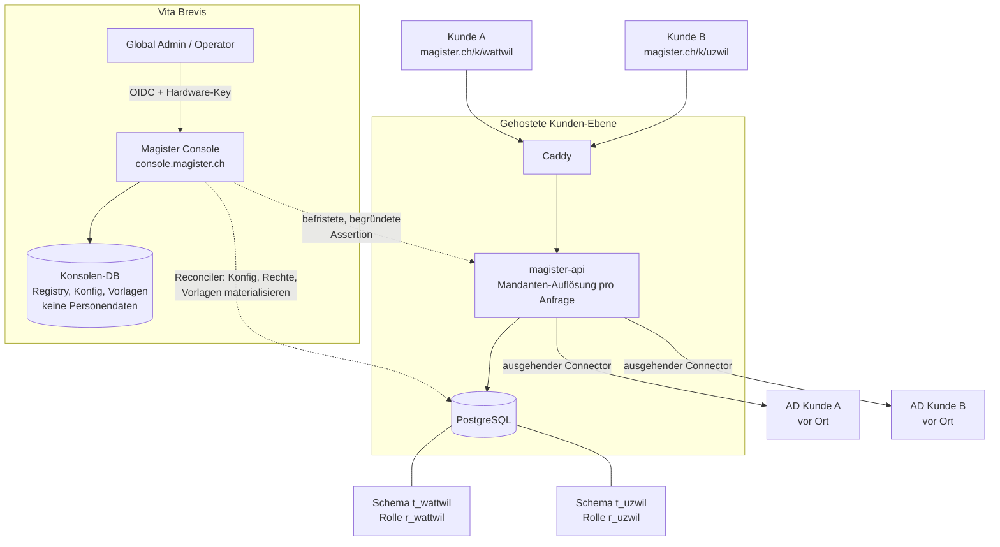

# Mandantenfähigkeit — Planung

> Umsetzungsplan zu [ADR-0013](../adr/0013-mandantenfaehigkeit-control-plane.md).
> Status: **Planung, nichts implementiert.** Mockup der Oberfläche:
> `docs/mockups/multitenancy-console/`.

## 1 · Ziel

Eine gehostete Magister-Plattform, auf der mehrere Kunden (Schulträger und
Firmen) betrieben werden. Vita Brevis erfasst Kunden und pflegt deren
Systemeinstellungen zentral; Kunden melden sich unter einem eigenen Pfad an und
sehen von der Plattform nichts. Die Trennung ist auf Datenbankebene erzwungen.

**Nicht Ziel:** die bestehenden On-Prem-Installationen ersetzen. Sie bleiben als
Betriebsart „ein Mandant" unverändert unterstützt (ADR-0013 D8).

## 2 · Begriffe

| Begriff | Bedeutung |
|---|---|
| Kunde / Mandant | Ein Schulträger oder eine Firma. Eigenes Schema, eigene DB-Rolle, eigener Pfad. |
| Standort | Bisherige `schools`-Zeile. Bleibt die Scope-Einheit *innerhalb* eines Kunden. |
| Konsole / Control Plane | Global-Admin-Oberfläche plus deren API und Datenbank. Weiterentwicklung von `cockpit/`. |
| Kunden-Ebene / Data Plane | Die bestehende `magister-api` plus `magister-web`, pro Anfrage auf genau einen Kunden aufgelöst. |
| Global Admin | Vita-Brevis-Rolle: Kunden, Systemeinstellungen, Rechte, Vorlagen. |
| Global Operator | Vita-Brevis-Rolle: alle Kunden sehen und bedienen, keine Plattformkonfiguration. |
| Kunden-Admin | Bisherige Rolle `admin`. Verliert Systemeinstellungen und die Rechte-Matrix. |

## 3 · Zielbild

Die gestrichelten Pfeile laufen **nie** im Anfrage-Pfad eines Kunden: die
Konsole schreibt in die Kundenschemas, aber kein Kunden-Request liest die
Konsolen-DB.

## 4 · Datenmodell

### 4.1 Konsolen-Datenbank (neu)

| Tabelle | Inhalt |
|---|---|
| `tenants` | `id`, `slug`, `name`, `customer_no`, `status` (`provisioning`/`active`/`suspended`/`offboarding`), `profile` (`school`/`company`/`neutral`), `path_prefix`, `custom_domain`, `isolation_mode` (`schema`/`database`/`cluster`), `dsn_ref`, `schema_name`, `db_role`, `schema_version`, `created_at` |
| `tenant_settings` | Autoritative Fassung dessen, was heute `app_settings` ist — **pro Kunde**, ohne `CHECK id = 1`. Secrets als Envelope-Referenz, nicht als Wert. |
| `tenant_secrets` | Pro Kunde: Datenschlüssel (Audit), AD-Bind-Passwort, OIDC-Client-Secret. Envelope-verschlüsselt mit dem Plattform-Schlüssel. |
| `tenant_entitlements` | Edition, Modul-Freischaltung, Benutzer-Limit, Lastgrenzen. |
| `global_roles` / `global_role_capabilities` | Globale Rechte-Matrix, pro Profil ein Standard-Set. |
| `global_document_templates` / `global_group_templates` | Globale Vorlagen mit `version` und `tenant_may_override`. |
| `rollouts` | Ein Auftrag je Ausrollung (Konfig, Rechte, Vorlagen, Migration) mit Status pro Kunde. |
| `provisioning_jobs` | Schritte beim Anlegen eines Kunden, wiederaufnehmbar. |
| `platform_operators` / `platform_role_assignments` | Global Admin / Global Operator. |
| `operator_access_grants` | Jeder Zugriff im Kundenkontext: Operator, Kunde, Grund/Ticket, Beginn, Ende. |
| `platform_audit_events` | Plattform-Audit, getrennt vom Kunden-Audit. |

### 4.2 Kundenschema (Änderungen)

- `app_settings` bleibt als **materialisierte Kopie** bestehen; neue Spalten
  `managed_by` (`platform`) und `source_version`. Schreibzugriff nur für den
  Reconciler (Rolle `r_reconciler`, nicht `r_<slug>`).
- `roles` / `role_capabilities` dito: Kopie, schreibgeschützt für den Kunden.
- `document_templates` / `group_templates`: neue Spalten `origin`
  (`global`/`tenant`), `global_template_id`, `global_version`,
  `tenant_may_override`. Auflösung: **Kunde+Standort → Kunde → global →
  eingebaut**.
- `sessions`: neue Spalte `tenant_id` (Gegenprobe zum aufgelösten Kunden) und
  `operator_grant_id` für Operator-Sitzungen.
- `audit_events`: die Ereignisse `settings_pushed`, `templates_pushed`,
  `rights_pushed`, `operator_access_started`, `operator_access_ended` sind für
  den Kunden lesbar — Transparenz ist Teil der Zusage.
- `role_assignments` bleibt unverändert beim Kunden (siehe offener Entscheid E2).

## 5 · Anfrage-Pfad

1. Caddy leitet `/k/<slug>/api/*` an die API weiter und gibt `<slug>` als Header mit.
2. Middleware löst `<slug>` gegen einen Registry-Cache auf: unbekannt → 404,
   `suspended` → eigene Seite, Stand ≠ Kopf-Version → 503 Wartung.
3. Aus dem Registry-Eintrag (DSN + Schema) kommt die Engine; pro Transaktion
   `SET LOCAL ROLE r_<slug>` und `SET LOCAL search_path = t_<slug>`.
4. Zusicherung: `current_user` passt zum Kunden der Anfrage, sonst Abbruch.
5. Session-Cookie wird gegen `sessions.tenant_id` geprüft; Kunde A auf Pfad B → 401.
6. Ab hier ist der bestehende Code unverändert — inklusive `school_id`-Filter,
   der weiterhin *innerhalb* eines Kunden gilt.

Die `SET LOCAL`-Variante erlaubt **einen** gemeinsamen Verbindungs-Pool: beide
Einstellungen enden mit der Transaktion, ein Pool kann nichts weitertragen.

## 6 · Was zieht wohin

| Heute | Künftig |
|---|---|
| `admin_settings.py` (`/admin/app-settings`) | **Konsole.** Aus der Kunden-API entfernt. |
| `admin_rbac.py` (`/admin/rbac`) | **Konsole.** Aus der Kunden-API entfernt. |
| `admin_modules.py` | **Konsole** (Freischaltung); `/me/modules` bleibt lesend beim Kunden. |
| `admin_system.py`, `admin_maintenance.py`, `services/web_tls.py` | **Konsole / Plattform-Betrieb.** |
| `admin_local_admin.py` | **Entfällt** in gehosteter Betriebsart (kein lokales Notkonto beim Kunden). |
| `admin_document_templates.py`, `group_templates.py` | Autorenstelle **Konsole**; Kunde liest, und überschreibt nur wo erlaubt. |
| `admin_roles.py` (Rollen*zuweisung* an Personen) | **Bleibt beim Kunden** — siehe E2. |
| `admin_sync.py` (Sync auslösen) | Bleibt beim Kunden; Intervall und Ziele kommen global. |
| Alles Fachliche (Benutzer, Klassen, Abteilungen, Geräte, Importe, Briefe, Auswertungen, Audit) | Bleibt beim Kunden. |

## 7 · Phasen

### Phase 1 — Mandanten-Abstraktion mit genau einem Kunden

Der wichtigste De-Risking-Schritt: die ganze Mechanik einbauen, **ohne**
Verhaltensänderung.

- Registry (zunächst aus Env, noch ohne Konsole), Auflösungs-Middleware,
  Engine-Registry, `SET LOCAL ROLE`/`search_path`, Zusicherung.
- Schema-Umzug `public` → `t_default`; Alembic mit `version_table_schema`;
  Migrations-Runner über die Registry.
- `MAGISTER_MULTITENANT=0` löst ohne Pfad-Präfix auf.
- **Abnahme:** Alle bestehenden Tests grün, keine sichtbare Änderung, ein
  Contract-Test beweist, dass `r_default` ein zweites Schema nicht lesen kann.

### Phase 2 — Konsole und Bereitstellung

- Konsolen-DB, `tenants`, Anmeldung via OIDC mit Hardware-Schlüssel.
- Kunden erfassen mit Bereitstellungs-Auftrag (Schema, Rolle, Grants, Alembic,
  Datenschlüssel) — wiederaufnehmbar, nie halb angelegt.
- Kundenliste, Kunden-Detail, Sperren und Entsperren.
- **Abnahme:** Zwei Kunden auf einer Installation, gegenseitiger DB-Zugriff
  scheitert an Postgres; ein abgebrochener Auftrag lässt den Kunden auf
  `provisioning` und unerreichbar.

### Phase 3 — Systemeinstellungen und Rechte umziehen

- `tenant_settings` und globale Rechte-Matrix in der Konsole; Reconciler
  materialisiert ins Kundenschema mit Audit-Ereignis.
- `/admin/app-settings` und `/admin/rbac` aus der Kunden-API **entfernen**;
  Frontend-Menüpunkte entfallen.
- Neue Plattform-Capabilities, die keine Kundenrolle halten kann.
- **Abnahme:** Ein Contract-Test zählt die Routen der Kunden-API und schlägt
  fehl, sobald eine System- oder Rechte-Route dort wieder auftaucht.

### Phase 4 — Globale Vorlagen

- Globale Vorlagen mit Version und `tenant_may_override`; Rollout auf alle
  Kunden, ein Profil oder eine Auswahl.
- Auflösungskette im Renderer; Hinweis „neue globale Fassung verfügbar" beim
  Kunden mit eigener Fassung.
- **Abnahme:** Rollout ist idempotent; ein Kunde mit eigener Fassung bleibt
  unverändert; Ausfall der Konsole verhindert kein Drucken.

### Phase 5 — Kundenwahl und Operator-Zugriff

- Kundenwahl nach dem Login, Grund/Ticket pflichtig.
- Assertion → befristete Kunden-Session; Hinweisbalken auf beiden Seiten;
  kundensichtbare Zugriffsliste.
- **Abnahme:** Eine abgelaufene oder zweimal eingelöste Assertion wird
  abgewiesen; jeder Zugriff steht im Kunden-Audit.

### Phase 6 — Betrieb im Grossen

- Migrations-Wellen mit Kanarienvogel und Versions-Schranke.
- Lastgrenzen pro Kunde (Verbindungen, `statement_timeout`, gleichzeitige
  Aufträge, Anfragen pro Minute).
- AD-Sync-Fan-out pro Kunde, versetzt, mit isoliertem Fehlerverhalten.
- Sicherung, Wiederherstellung, Export und Löschung **pro Kunde**; Umzug auf
  eigene Datenbank oder eigenen Cluster.
- Ausgehender On-Prem-AD-Connector (ADR-0013 D10).

## 8 · Neue harte Regeln (Ergänzung zu CLAUDE.md)

- **Niemals** eine DB-Verbindung benutzen, ohne dass die Mandanten-Auflösung
  Rolle und `search_path` für die Transaktion gesetzt hat.
- **Niemals** `SET ROLE` oder `SET search_path` ohne `LOCAL`.
- **Niemals** aus der Kunden-Ebene die Konsolen-Datenbank lesen oder schreiben.
- **Niemals** eine System- oder Rechte-Konfigurationsroute in der Kunden-API
  mounten.
- **Niemals** einen kundenübergreifenden Query ohne `# scope-bypass: <reason>`
  *und* Ausführung als Plattform-Rolle.
- **Immer** Personendaten eines Kunden nur im Kundenschema — die Konsolen-DB
  bleibt frei davon.
- **Immer** ein kundensichtbares Audit-Ereignis bei Operator-Zugriff und bei
  jedem Rollout in ein Kundenschema.

## 9 · Risiken

| Risiko | Gegenmassnahme |
|---|---|
| Die Konsole kann Sitzungen in jeden Kunden ausstellen — höchstwertiges Ziel. | Eigene Origin, OIDC mit Hardware-Schlüssel und verwaltetem Gerät, keine Personendaten in der Konsolen-DB, kurze TTL, Grund pflichtig, unveränderliches Audit, optional Freigabe durch den Kunden. |
| Verbindungs- und Migrationsaufwand wächst mit der Kundenzahl. | Ein Pool mit `SET LOCAL ROLE`, pgbouncer, Obergrenzen pro Kunde, Wellen-Runner. |
| Ein Kunde reisst die Last an sich. | `statement_timeout`, Auftrags-Obergrenze, Anfragegrenzen, Umzug auf eigene DB oder eigenen Cluster. |
| Versions-Schieflage zwischen Code und Kundenschema. | Nur erweiternde Migrationen, Stand in der Registry, 503 Wartung statt falscher Query. |
| Falscher Kunde aufgelöst (Code-Fehler, nicht vergessener Filter). | Zusicherung vor dem ersten Query, `tenant_id` in der Session, Auflösung genau an einer Stelle, Contract-Tests. |
| Alle Kunden auf einer Origin: XSS- und Storage-Radius. | Siehe E1 — Subdomain pro Kunde als Zielbild. |
| Rechtlich: Auftragsverarbeitung für Daten Minderjähriger. | AVV pro Kunde, dokumentierte Trennung, Datenhaltung in der Schweiz, Lösch- und Exportpfad pro Kunde, Revision der Zero-Phone-Home-Politik. |
| Reconciler-Drift (Kopie ≠ Autorenstelle). | Idempotent, versioniert, Abweichungsanzeige in der Konsole, regelmässiger Abgleich. |

## 10 · Offene Entscheide

- **E1 · Pfad oder Subdomain?** Der Auftrag nennt einen eigenen Pfad. Technisch
  ist eine Subdomain pro Kunde die härtere Grenze (eigene Origin, eigener
  Browser-Storage, XSS bleibt beim Kunden). *Vorschlag:* Subdomain als Zielbild,
  Pfad als Alias — die Auflösung kann beides.
- **E2 · Rollen*zuweisung* an Personen: Kunde oder global?** Der Auftrag sagt
  „Rechte nur als Global Admin". Der Plan legt die **Matrix** global und lässt
  die **Zuweisung** beim Kunden — sonst muss Vita Brevis jeden Rollenwechsel
  einer Schulleitung selbst vornehmen. Muss bestätigt werden.
- **E3 · Was bleibt dem Kunden-Admin?** Vorschlag: Standorte, Klassen,
  Abteilungen, Benutzer, Importe, Geräte, Auswertungen, Rollenzuweisung. Ohne:
  System, Rechte-Matrix, Module, Zertifikate, lokales Notkonto.
- **E4 · Bestandskunden.** Bleiben die heutigen On-Prem-Installationen dauerhaft,
  oder gibt es einen Migrationspfad in die gehostete Plattform (Export/Import
  eines ganzen Schemas)?
- **E5 · Standard-Isolationsstufe.** Schema für alle, eigene Datenbank ab einer
  Grösse oder auf Wunsch — oder eigene Datenbank von Anfang an für alle?
- **E6 · Konsole erweitern oder trennen?** Der Plan lässt `cockpit/` zur Konsole
  wachsen. ADR-0003 sieht ohnehin die Auslagerung in ein eigenes Repo vor — die
  Frage ist nur, ob das *vor* oder *nach* diesem Ausbau passiert.

## 11 · Mockup

`docs/mockups/multitenancy-console/` — neun Bildschirme: Anmeldung, Kundenwahl,
Kundenliste, Kunde mit Systemeinstellungen, Kunde erfassen, Rechte-Matrix,
globale Vorlagen mit Rollout, Datenbank und Migrationen, Kundenkontext aus
beiden Perspektiven. Farben, Schrift und Bausteine sind aus `apps/web`
übernommen; alle Kundennamen und Zahlen sind Platzhalter.
