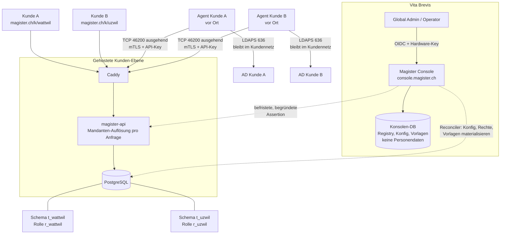

# Mandantenfähigkeit — Planung

> Umsetzungsplan zu [ADR-0013](../adr/0013-mandantenfaehigkeit-control-plane.md)
> (Mandantenfähigkeit), [ADR-0014](../adr/0014-ad-connector-agent.md)
> (AD-Connector-Agent), [ADR-0015](../adr/0015-authentisierungs-haertung.md)
> (Authentisierungs-Härtung) und
> [ADR-0016](../adr/0016-sicherung-wiederherstellung-export.md) (Sicherung,
> Wiederherstellung, Export).
> Status: **Planung, nichts implementiert.** Mockup der Oberfläche:
> `docs/mockups/multitenancy-console/`.

## 1 · Ziel

Eine gehostete Magister-Plattform, auf der mehrere Kunden (Schulträger und
Firmen) betrieben werden. Vita Brevis erfasst Kunden und pflegt deren
Systemeinstellungen zentral; Kunden melden sich unter einem eigenen Pfad an und
sehen von der Plattform nichts. Die Trennung ist auf Datenbankebene erzwungen.

**Nicht Ziel:** die bestehenden On-Prem-Installationen ersetzen. Sie bleiben als
Betriebsart „ein Mandant" unverändert unterstützt (ADR-0013 D8).

## 2 · Begriffe

| Begriff | Bedeutung |
|---|---|
| Kunde / Mandant | Ein Schulträger oder eine Firma. Eigenes Schema, eigene DB-Rolle, eigener Pfad. |
| Standort | Bisherige `schools`-Zeile. Bleibt die Scope-Einheit *innerhalb* eines Kunden. |
| Konsole / Control Plane | Global-Admin-Oberfläche plus deren API und Datenbank. Weiterentwicklung von `cockpit/`. |
| Kunden-Ebene / Data Plane | Die bestehende `magister-api` plus `magister-web`, pro Anfrage auf genau einen Kunden aufgelöst. |
| Global Admin | Vita-Brevis-Rolle: Kunden, Systemeinstellungen, Rechte, Vorlagen. |
| Global Operator | Vita-Brevis-Rolle: alle Kunden sehen und bedienen, keine Plattformkonfiguration. |
| Kunden-Admin | Bisherige Rolle `admin`. Verliert Systemeinstellungen und die Rechte-Matrix. |
| Connector-Agent | Kleiner Dienst im Kundennetz, der ausgehend zur Plattform telefoniert und dort die AD-Aufträge abholt. Einziger Prozess mit AD-Zugang. |

## 3 · Zielbild

Die Agenten bauen ihre Verbindung selbst auf; die Plattform öffnet nie eine
Verbindung ins Kundennetz.

Drei Listener mit drei Erreichbarkeiten:

| Listener | Adresse | Wer | Aus dem Internet |
|---|---|---|---|
| Kundenoberfläche | `0.0.0.0:443` | Lehr- und Leitungspersonen, MFA über Entra | erreichbar, WAF davor |
| Konsole | `10.0.0.5:4444` | Global Admin, Global Operator | **nicht geroutet** |
| Connector | `0.0.0.0:46200` | Connector-Agenten, nur mit Client-Zertifikat | erreichbar |

Das Usermanagement des Kunden gehört ins Internet, das Global Management nicht.
Quell-IP-Regeln macht die Fortigate mit der WAF, nicht Magister.

Die gestrichelten Pfeile laufen **nie** im Anfrage-Pfad eines Kunden: die
Konsole schreibt in die Kundenschemas, aber kein Kunden-Request liest die
Konsolen-DB.

## 4 · Datenmodell

### 4.1 Konsolen-Datenbank (neu)

| Tabelle | Inhalt |
|---|---|
| `tenants` | `id`, `slug`, `name`, `customer_no`, `status` (`provisioning`/`active`/`suspended`/`offboarding`), `profile` (`school`/`company`/`neutral`), `path_prefix`, `custom_domain`, `isolation_mode` (`schema`/`database`/`cluster`), `dsn_ref`, `schema_name`, `db_role`, `schema_version`, `created_at` |
| `tenant_settings` | Autoritative Fassung dessen, was heute `app_settings` ist — **pro Kunde**, ohne `CHECK id = 1`. Secrets als Envelope-Referenz, nicht als Wert. |
| `tenant_secrets` | Pro Kunde: Datenschlüssel (Audit), AD-Bind-Passwort, OIDC-Client-Secret. Envelope-verschlüsselt mit dem Plattform-Schlüssel. |
| `tenant_entitlements` | Edition, Modul-Freischaltung, Benutzer-Limit, Lastgrenzen. |
| `global_roles` / `global_role_capabilities` | Globale Rechte-Matrix, pro Profil ein Standard-Set. |
| `global_document_templates` / `global_group_templates` | Globale Vorlagen mit `version` und `tenant_may_override`. |
| `rollouts` | Ein Auftrag je Ausrollung (Konfig, Rechte, Vorlagen, Migration) mit Status pro Kunde. |
| `provisioning_jobs` | Schritte beim Anlegen eines Kunden, wiederaufnehmbar. |
| `platform_operators` / `platform_role_assignments` | Global Admin / Global Operator. |
| `operator_access_grants` | Jeder Zugriff im Kundenkontext: Operator, Kunde, Grund/Ticket, Beginn, Ende. |
| `platform_audit_events` | Plattform-Audit, getrennt vom Kunden-Audit. |
| `connector_agents` | Pro Kunde ein bis mehrere Agenten: Name, Status, Version, letzter Kontakt, SPKI-Fingerprint des Client-Zertifikats, Ablaufdatum, argon2id-Hash des API-Keys, Widerruf-Flag. |
| `connector_enrollments` | Einmal-Token für die Anmeldung eines Agenten: Kunde, Hash, Ablauf, eingelöst-am, ausgestellt-von. |
| `connector_jobs` | Auftragswarteschlange: Kunde, Methode (aus der Allowlist), Nutzlast, Status, TTL, Ergebnis, HMAC. Nutzlasten mit Passwörtern werden nach Abschluss sofort gelöscht. |
| `platform_ca` | CA-Zustand: Intermediate pro Kunde, Seriennummern, Widerrufsliste (intern, kein CRL-Vertrieb). |
| `tenant_backups` | Eine Zeile pro Sicherung: Kunde, Zeitpunkt, Art (`daily`/`monthly`/`pre_migration`/`manual`), Ablage, Grösse, Prüfsumme, Schlüssel-Id, `verified_at`. |
| `tenant_backup_policy` | Aufbewahrung, Zeitfenster, Ziel-Ablagen, RPO/RTO pro Kunde — Vertragswerte. |
| `restore_jobs` / `export_jobs` | Wiederherstellungen (Quelle, Ziel-Schema, Freigaben) und Exporte (Umfang, Prüfsumme, Ablauf des Download-Links). |

### 4.2 Kundenschema (Änderungen)

- `app_settings` bleibt als **materialisierte Kopie** bestehen; neue Spalten
  `managed_by` (`platform`) und `source_version`. Schreibzugriff nur für den
  Reconciler (Rolle `r_reconciler`, nicht `r_<slug>`).
- `roles` / `role_capabilities` dito: Kopie, schreibgeschützt für den Kunden.
- `document_templates` / `group_templates`: neue Spalten `origin`
  (`global`/`tenant`), `global_template_id`, `global_version`,
  `tenant_may_override`. Auflösung: **Kunde+Standort → Kunde → global →
  eingebaut**.
- `sessions`: neue Spalte `tenant_id` (Gegenprobe zum aufgelösten Kunden) und
  `operator_grant_id` für Operator-Sitzungen.
- `audit_events`: die Ereignisse `settings_pushed`, `templates_pushed`,
  `rights_pushed`, `operator_access_started`, `operator_access_ended` sind für
  den Kunden lesbar — Transparenz ist Teil der Zusage.
- `role_assignments` bleibt unverändert beim Kunden (siehe offener Entscheid E2).
- `local_admins`: neue Spalten `totp_secret_enc`, `totp_confirmed_at`,
  `totp_last_step`, `recovery_codes`, dazu `totp_reset_at` / `totp_reset_by` und
  `mfa_suspended_until` für die befristete Aufhebung (ADR-0015 D2). Gehostet ist
  dieser Anmeldeweg ganz abgeschaltet; on-prem ist er der Notzugang.
- `app_settings`: `ad_login_enabled` und `ad_login_group` fallen weg (ADR-0015 D3).

## 5 · Anfrage-Pfad

1. Caddy leitet `/k/<slug>/api/*` an die API weiter und gibt `<slug>` als Header mit.
2. Middleware löst `<slug>` gegen einen Registry-Cache auf: unbekannt → 404,
   `suspended` → eigene Seite, Stand ≠ Kopf-Version → 503 Wartung.
3. Aus dem Registry-Eintrag (DSN + Schema) kommt die Engine; pro Transaktion
   `SET LOCAL ROLE r_<slug>` und `SET LOCAL search_path = t_<slug>`.
4. Zusicherung: `current_user` passt zum Kunden der Anfrage, sonst Abbruch.
5. Session-Cookie wird gegen `sessions.tenant_id` geprüft; Kunde A auf Pfad B → 401.
6. Ab hier ist der bestehende Code unverändert — inklusive `school_id`-Filter,
   der weiterhin *innerhalb* eines Kunden gilt.

Die `SET LOCAL`-Variante erlaubt **einen** gemeinsamen Verbindungs-Pool: beide
Einstellungen enden mit der Transaktion, ein Pool kann nichts weitertragen.

## 6 · Was zieht wohin

| Heute | Künftig |
|---|---|
| `admin_settings.py` (`/admin/app-settings`) | **Konsole.** Aus der Kunden-API entfernt. |
| `admin_rbac.py` (`/admin/rbac`) | **Konsole.** Aus der Kunden-API entfernt. |
| `admin_modules.py` | **Konsole** (Freischaltung); `/me/modules` bleibt lesend beim Kunden. |
| `admin_system.py`, `admin_maintenance.py`, `services/web_tls.py` | **Konsole / Plattform-Betrieb.** |
| `admin_local_admin.py` | **Entfällt** in gehosteter Betriebsart (kein lokales Notkonto beim Kunden). |
| `admin_document_templates.py`, `group_templates.py` | Autorenstelle **Konsole**; Kunde liest, und überschreibt nur wo erlaubt. |
| `admin_roles.py` (Rollen*zuweisung* an Personen) | **Bleibt beim Kunden** — siehe E2. |
| `admin_sync.py` (Sync auslösen) | Bleibt beim Kunden; Intervall und Ziele kommen global. |
| `POST /auth/login/ad` | **Entfällt** (ADR-0015 D3) — der Code wird entfernt, nicht abgeschaltet. |
| `POST /auth/login/local` | Bleibt on-prem, zweistufig mit TOTP; gehostet abgeschaltet. |
| `routers/ad_rpc.py` (eingehendes AD-RPC) | Bleibt für den Monolith und den Container-Split; gehostet tritt der Connector-Rücken daneben (ADR-0014). |
| — neu — | `/connector/*` (Anmeldung, Auftragsabruf, Ergebnis, Zertifikatserneuerung): eigener Listener auf `0.0.0.0:46200`, nur mit Client-Zertifikat, nicht Teil der Kunden-API. |
| — neu — | `/auth/local/totp/*` (Einrichtung, Prüfung) beim Kunden; die vier Reset-Eingriffe liegen in der Konsole beziehungsweise im CLI. |
| — neu — | `magister-cli local-admin totp-reset` (`--new-recovery-codes`, `--disable`) für On-prem-Installationen ohne Konsole. |
| Alles Fachliche (Benutzer, Klassen, Abteilungen, Geräte, Importe, Briefe, Auswertungen, Audit) | Bleibt beim Kunden. |

## 7 · Phasen

### Phase 0 — Authentisierungs-Härtung (unabhängig, kann sofort)

Braucht keine Mandantenfähigkeit und verkleinert die Angriffsfläche, bevor
irgendetwas gehostet wird. Referenz: ADR-0015.

- **AD-Login entfernen.** Ausbau in zwei Releases nach der Datei-Liste in
  ADR-0015 D3; Start bricht laut ab, wenn `MAGISTER_AD_LOGIN_*` noch gesetzt
  ist; im zweiten Release entfernt Alembic die beiden Spalten.
- **TOTP für lokale Konten**, verpflichtend, mit Wiederherstellungscodes und
  erzwungener Einrichtung.
- **Vier Reset-Eingriffe** (ADR-0015 D2): zurücksetzen, neue
  Wiederherstellungscodes, Konto deaktivieren, MFA-Pflicht befristet aufheben —
  on-prem über `magister-cli local-admin totp-reset`, gehostet später über die
  Konsole. Jeder Eingriff mit eigenem, kundensichtbarem Audit-Ereignis.
- **Konsolen-Listener** vorbereiten: eigener Site-Block, Bindung an die interne
  Adresse, Client-Zertifikat gegen die private CA, Marker-Riegel in der
  Anwendung. (Die Konsole selbst kommt in Phase 2 — Listener und CA sind die
  Vorarbeit, die der Connector in Phase 2a ebenfalls braucht.)
- **Abnahme:** Kein Anmeldeweg ohne zweiten Faktor; ein Contract-Test verweigert
  jede Route unter `/auth/login/ad`; ein lokales Konto ohne bestätigtes TOTP
  erreicht ausschliesslich die Einrichtungsseite; ein zurückgesetztes Konto
  landet beim nächsten Anmelden zwingend in der Einrichtung und bekommt dabei
  kein Geheimnis angezeigt; eine aufgehobene MFA-Pflicht greift nach 24 Stunden
  von selbst wieder; der Konsolen-Listener ist auf der öffentlichen Adresse
  nicht gebunden und lehnt ohne Client-Zertifikat den Handshake ab.

### Phase 1 — Mandanten-Abstraktion mit genau einem Kunden

Der wichtigste De-Risking-Schritt: die ganze Mechanik einbauen, **ohne**
Verhaltensänderung.

- Registry (zunächst aus Env, noch ohne Konsole), Auflösungs-Middleware,
  Engine-Registry, `SET LOCAL ROLE`/`search_path`, Zusicherung.
- Schema-Umzug `public` → `t_default`; Alembic mit `version_table_schema`;
  Migrations-Runner über die Registry — der zieht pro Kunde einen Dump, **bevor**
  er migriert (ADR-0016 D6, die Rückfahrkarte).
- `MAGISTER_MULTITENANT=0` löst ohne Pfad-Präfix auf.
- **Abnahme:** Alle bestehenden Tests grün, keine sichtbare Änderung, ein
  Contract-Test beweist, dass `r_default` ein zweites Schema nicht lesen kann.

### Phase 2 — Konsole und Bereitstellung

- Konsolen-DB, `tenants`, Anmeldung via OIDC mit Hardware-Schlüssel.
- Kunden erfassen mit Bereitstellungs-Auftrag (Schema, Rolle, Grants, Alembic,
  Datenschlüssel) — wiederaufnehmbar, nie halb angelegt.
- Kundenliste, Kunden-Detail, Sperren und Entsperren.
- **Abnahme:** Zwei Kunden auf einer Installation, gegenseitiger DB-Zugriff
  scheitert an Postgres; ein abgebrochener Auftrag lässt den Kunden auf
  `provisioning` und unerreichbar.

### Phase 2a — AD-Connector-Agent

Blockiert den ersten gehosteten Kunden: ohne Agenten gibt es keinen
Passwort-Reset. Referenz: ADR-0014.

- **Plattform-CA**: Offline-Root, Intermediate pro Kunde, Ausstellung über
  CSR-Anmeldung, Widerruf als Datenbank-Flag.
- **Connector-Endpunkt** auf eigenem Listener `0.0.0.0:46200` mit
  `require_and_verify`, plus Abgleich von SPKI-Fingerprint und API-Key gegen
  dieselbe Agent-Zeile. Optionale Rückfallebene auf 443 für Kundennetze, die
  hohe Ports ausgehend sperren (Entscheid E11).
- **Auftragswarteschlange** hinter der bestehenden `AdClient`-Schnittstelle als
  dritter Rücken (nach *direkt* und *eingehendem RPC*) — kein Aufrufer im
  Fachcode ändert sich. Methodenmenge ist die Allowlist aus `ad/rpc.py`.
- **Agent** für Windows (MSI, Dienst), Linux (`.deb`, systemd) und als
  OCI-Image: Schlüsselerzeugung lokal, Long-Poll-Abruf, Ergebnis mit HMAC,
  Sync-Seiten als Push, lokale OU-Allowlist und Gruppen-Denylist, lokales
  Protokoll, automatische Zertifikatserneuerung.
- **Konsole**: Paket-Download mit Einmal-Token, Fingerprint-Anzeige nach der
  Anmeldung, API-Key- und Zertifikatsrotation, Agent-Status, Ereignisliste.
- **Konsole**: die vier Reset-Eingriffe für den Notzugang des Kunden
  (Phase 0 hat sie im CLI, hier kommen sie in die Oberfläche).
- **Abnahme:** Passwort-Reset über den Agenten funktioniert; ein Kunde, dessen
  Agent steht, bekommt `503` mit dem bestehenden Banner statt eines Fehlers; ein
  Client-Zertifikat von Kunde A wird auf dem Kanal von Kunde B abgewiesen; ein
  Auftrag mit einer Methode ausserhalb der Allowlist wird schon plattformseitig
  verweigert; das Download-Paket enthält kein Geheimnis; Agent stoppen beendet
  jeden Plattformzugriff auf das AD.

### Phase 2b — Sicherung, Wiederherstellung, Export

Ebenfalls Voraussetzung für den ersten gehosteten Kunden: ohne Restore-Weg pro
Kunde darf keine Fremddaten-Haltung starten. Referenz: ADR-0016.

- **Cluster-PITR** (WAL-Archivierung plus Basebackup) für „Datenbank kaputt".
- **Logische Sicherung pro Kunde** (`pg_dump --schema=t_<slug>`), mit `age`
  verschlüsselt, lokal und in einem unveränderlichen Objektspeicher in der
  Schweiz.
- **Wöchentliche Prüf-Wiederherstellung** in ein Wegwerf-Schema mit
  Prüfabfragen; Ergebnis pro Kunde in der Konsole.
- **Restore daneben, nie darüber**: neues Schema, Umschalten erst nach Freigabe
  durch eine zweite Person, altes Schema bleibt stehen.
- **Export** in offenen Formaten (CSV plus Manifest), zeitlich begrenzter
  Download, auditiert.
- **Offboarding-Ablauf** mit Karenzzeit, Crypto-Shredding des Kundenschlüssels
  und Löschung mit Fristablauf.
- **Aufbewahrung pro Kunde** als Vertragswert, in der Konsole sichtbar.
- **On-prem**: bestehende Sidecar plus Verschlüsselung, Prüf-Wiederherstellung
  und `magister-cli backup verify`.
- **Abnahme:** Ein Kunde wird aus einem Dump in ein Nebenschema
  wiederhergestellt, ohne dass ein anderer Kunde etwas merkt; ein absichtlich
  beschädigter Dump fällt in der wöchentlichen Prüfung auf; ein Export ist ohne
  Magister lesbar; nach dem Vernichten des Kundenschlüssels ist kein
  Audit-Payload mehr entschlüsselbar.

### Phase 3 — Systemeinstellungen und Rechte umziehen

- `tenant_settings` und globale Rechte-Matrix in der Konsole; Reconciler
  materialisiert ins Kundenschema mit Audit-Ereignis.
- `/admin/app-settings` und `/admin/rbac` aus der Kunden-API **entfernen**;
  Frontend-Menüpunkte entfallen.
- Neue Plattform-Capabilities, die keine Kundenrolle halten kann.
- **Abnahme:** Ein Contract-Test zählt die Routen der Kunden-API und schlägt
  fehl, sobald eine System- oder Rechte-Route dort wieder auftaucht.

### Phase 4 — Globale Vorlagen

- Globale Vorlagen mit Version und `tenant_may_override`; Rollout auf alle
  Kunden, ein Profil oder eine Auswahl.
- Auflösungskette im Renderer; Hinweis „neue globale Fassung verfügbar" beim
  Kunden mit eigener Fassung.
- **Abnahme:** Rollout ist idempotent; ein Kunde mit eigener Fassung bleibt
  unverändert; Ausfall der Konsole verhindert kein Drucken.

### Phase 5 — Kundenwahl und Operator-Zugriff

- Kundenwahl nach dem Login, Grund/Ticket pflichtig.
- Assertion → befristete Kunden-Session; Hinweisbalken auf beiden Seiten;
  kundensichtbare Zugriffsliste.
- **Abnahme:** Eine abgelaufene oder zweimal eingelöste Assertion wird
  abgewiesen; jeder Zugriff steht im Kunden-Audit.

### Phase 6 — Betrieb im Grossen

- Migrations-Wellen mit Kanarienvogel und Versions-Schranke.
- Lastgrenzen pro Kunde (Verbindungen, `statement_timeout`, gleichzeitige
  Aufträge, Anfragen pro Minute).
- AD-Sync-Fan-out pro Kunde, versetzt, mit isoliertem Fehlerverhalten.
- Umzug eines Kunden auf eine eigene Datenbank oder einen eigenen Cluster
  (nutzt den Restore-Weg aus Phase 2b).
- Connector-Flotte betreiben: Agent-Versionen, Zertifikatsablauf,
  Erneuerungsfehler und stehende Agenten überwachen und alarmieren.

## 8 · Neue harte Regeln (Ergänzung zu CLAUDE.md)

- **Niemals** eine DB-Verbindung benutzen, ohne dass die Mandanten-Auflösung
  Rolle und `search_path` für die Transaktion gesetzt hat.
- **Niemals** `SET ROLE` oder `SET search_path` ohne `LOCAL`.
- **Niemals** aus der Kunden-Ebene die Konsolen-Datenbank lesen oder schreiben.
- **Niemals** eine System- oder Rechte-Konfigurationsroute in der Kunden-API
  mounten.
- **Niemals** einen kundenübergreifenden Query ohne `# scope-bypass: <reason>`
  *und* Ausführung als Plattform-Rolle.
- **Immer** Personendaten eines Kunden nur im Kundenschema — die Konsolen-DB
  bleibt frei davon.
- **Immer** ein kundensichtbares Audit-Ereignis bei Operator-Zugriff und bei
  jedem Rollout in ein Kundenschema.
- **Niemals** einen Connector-Auftrag annehmen, dessen Methode nicht in der
  Allowlist steht — und niemals eine Auftragsart einführen, die beliebiges
  LDAP, PowerShell oder Skripte im Kundennetz ausführt.
- **Niemals** ein Geheimnis in ein herunterladbares Agent-Paket legen; der
  private Schlüssel entsteht auf dem Agenten.
- **Niemals** einen Connector-Kanal ohne *beide* Faktoren akzeptieren
  (Client-Zertifikat mit passendem Fingerprint **und** API-Key derselben Zeile).
- **Niemals** das Klartext-Passwort eines Verzeichnisbenutzers gegen AD binden.
  Einzige Ausnahme bleibt der Probe-Bind eines gerade selbst gesetzten
  Passworts (`probe_bind_as_user`).
- **Niemals** einen Anmeldeweg ohne zweiten Faktor einführen oder
  wiederherstellen.
- **Immer** die Konsole nur über den Management-Listener bedienen; eine Anfrage
  ohne dessen Marker wird abgewiesen.
- **Niemals** den Konsolen-Listener auf `0.0.0.0` binden.
- **Niemals** die MFA-Pflicht unbefristet aufheben; die Aufhebung läuft nach
  24 Stunden von selbst ab.
- **Niemals** bei einem TOTP-Reset ein Geheimnis anzeigen oder zurückgeben — der
  Reset löscht nur, das neue Geheimnis entsteht bei der Einrichtung.
- **Niemals** Quell-IP-Regeln in Magister nachbauen; Netzfilter gehören auf die
  Firewall und die WAF.
- **Niemals** eine Wiederherstellung über ein Produktivschema laufen lassen —
  immer in ein neues Schema, Umschalten ist ein getrennter, freigegebener
  Schritt. Kein `DROP SCHEMA … CASCADE` auf ein Produktivschema.
- **Niemals** einen Kunden-Dump unverschlüsselt schreiben oder ablegen.
- **Niemals** Kundenschlüssel und Dump in derselben Ablage sichern.
- **Immer** vor einer Migration pro Kunde einen Dump ziehen.

## 9 · Risiken

| Risiko | Gegenmassnahme |
|---|---|
| Die Konsole kann Sitzungen in jeden Kunden ausstellen — höchstwertiges Ziel. | Eigene Origin, OIDC mit Hardware-Schlüssel und verwaltetem Gerät, keine Personendaten in der Konsolen-DB, kurze TTL, Grund pflichtig, unveränderliches Audit, optional Freigabe durch den Kunden. |
| Verbindungs- und Migrationsaufwand wächst mit der Kundenzahl. | Ein Pool mit `SET LOCAL ROLE`, pgbouncer, Obergrenzen pro Kunde, Wellen-Runner. |
| Ein Kunde reisst die Last an sich. | `statement_timeout`, Auftrags-Obergrenze, Anfragegrenzen, Umzug auf eigene DB oder eigenen Cluster. |
| Versions-Schieflage zwischen Code und Kundenschema. | Nur erweiternde Migrationen, Stand in der Registry, 503 Wartung statt falscher Query. |
| Falscher Kunde aufgelöst (Code-Fehler, nicht vergessener Filter). | Zusicherung vor dem ersten Query, `tenant_id` in der Session, Auflösung genau an einer Stelle, Contract-Tests. |
| Alle Kunden auf einer Origin: XSS- und Storage-Radius. | Siehe E1 — Subdomain pro Kunde als Zielbild. |
| Rechtlich: Auftragsverarbeitung für Daten Minderjähriger. | AVV pro Kunde, dokumentierte Trennung, Datenhaltung in der Schweiz, Lösch- und Exportpfad pro Kunde, Revision der Zero-Phone-Home-Politik. |
| Reconciler-Drift (Kopie ≠ Autorenstelle). | Idempotent, versioniert, Abweichungsanzeige in der Konsole, regelmässiger Abgleich. |
| Der Agent wird zum Ausfallpunkt für Passwort-Resets. | Mehrere Agenten pro Kunde zulässig, Überwachung mit Alarm, `503` mit dem bestehenden Banner statt eines stillen Fehlers, Auftrags-TTL statt verspäteter Ausführung. |
| Kompromittierte Plattform greift über den Agenten ins Kundennetz. | Nur Aufträge aus der Methoden-Allowlist, dazu die lokal erzwungene Politik des Agenten (OU-Allowlist, Gruppen-Denylist, abschaltbare Operationen) und der Not-Aus beim Kunden. |
| Verlust des Agent-Schlüssels oder des Kundengeräts. | Schlüssel nicht exportierbar erzeugt, Widerruf als Datenbank-Flag mit sofortiger Wirkung, 90-Tage-Zertifikate mit automatischer Erneuerung. |
| Notzugang verloren (kein Telefon, keine Wiederherstellungscodes). | Zehn Codes bei der Einrichtung, Reset über die Konsole (gehostet) beziehungsweise ein dokumentiertes und geübtes Offline-Verfahren (on-prem). |
| Konsolen-Listener aus Versehen auf `0.0.0.0` gebunden. | Bindung an die interne Adresse ist die Massnahme; dazu Client-Zertifikat und Marker-Riegel als zweite und dritte Schicht, plus ein Start-Check, der eine Bindung auf `0.0.0.0` ablehnt. |
| Kundennetz sperrt ausgehend hohe Ports, der Agent kommt nicht heraus. | Firewall-Anforderung im Onboarding-Runbook benennen; Rückfallebene auf 443 mit demselben mTLS-Zwang (Entscheid E11). |
| Befristete MFA-Aufhebung wird zur Gewohnheit. | 24-Stunden-Automatik ohne Verlängerungsknopf, Grund/Ticket verpflichtend, Warnbalken in der Oberfläche, Ereignis im Kunden-Audit. |
| Sicherung vorhanden, aber nicht wiederherstellbar. | Wöchentliche Prüf-Wiederherstellung mit Prüfabfragen; „zuletzt geprüft" pro Kunde in der Konsole; ein nie geprüfter Dump gilt als nicht vorhanden. |
| Dump wiederhergestellt, aber Kundenschlüssel fehlt — Audit-Payloads unlesbar. | Schlüssel in getrenntem Tresor mit eigener Sicherung, Schlüssel-Id im Dump vermerkt, Entschlüsselbarkeit ist Teil der wöchentlichen Prüfung. |
| Angreifer mit Serverzugang löscht die Sicherungen mit. | Kopie in einem Objektspeicher mit Object Lock; der Anwendungsserver kennt nur den öffentlichen Backup-Schlüssel. |
| Löschzusage beim Offboarding nicht einhaltbar. | Crypto-Shredding sofort, vollständige Löschung mit Fristablauf — genau so im Vertrag und in der AVV formuliert, nicht als „sofort alles weg". |
| Operator setzt TOTP und Passwort zurück und übernimmt den Notzugang. | Liegt in der Natur eines Break-Glass-Kontos. Abgesichert durch: Reset zeigt nie ein Geheimnis, Passwort-Reset ist eine getrennte Handlung, beide Ereignisse stehen im Audit des Kunden und in dessen Zugriffsliste. |

## 10 · Offene Entscheide

- **E1 · Pfad oder Subdomain?** Der Auftrag nennt einen eigenen Pfad. Technisch
  ist eine Subdomain pro Kunde die härtere Grenze (eigene Origin, eigener
  Browser-Storage, XSS bleibt beim Kunden). *Vorschlag:* Subdomain als Zielbild,
  Pfad als Alias — die Auflösung kann beides.
- **E2 · Rollen*zuweisung* an Personen: Kunde oder global?** Der Auftrag sagt
  „Rechte nur als Global Admin". Der Plan legt die **Matrix** global und lässt
  die **Zuweisung** beim Kunden — sonst muss Vita Brevis jeden Rollenwechsel
  einer Schulleitung selbst vornehmen. Muss bestätigt werden.
- **E3 · Was bleibt dem Kunden-Admin?** Vorschlag: Standorte, Klassen,
  Abteilungen, Benutzer, Importe, Geräte, Auswertungen, Rollenzuweisung. Ohne:
  System, Rechte-Matrix, Module, Zertifikate, lokales Notkonto.
- **E4 · Bestandskunden.** Bleiben die heutigen On-Prem-Installationen dauerhaft,
  oder gibt es einen Migrationspfad in die gehostete Plattform (Export/Import
  eines ganzen Schemas)?
- **E5 · Standard-Isolationsstufe.** Schema für alle, eigene Datenbank ab einer
  Grösse oder auf Wunsch — oder eigene Datenbank von Anfang an für alle?
- **E6 · Konsole erweitern oder trennen?** Der Plan lässt `cockpit/` zur Konsole
  wachsen. ADR-0003 sieht ohnehin die Auslagerung in ein eigenes Repo vor — die
  Frage ist nur, ob das *vor* oder *nach* diesem Ausbau passiert.
- **E7 · Nutzt heute jemand den AD-Login?** Wenn ja, muss dieser Kunde vor dem
  Ausbau auf OIDC — Release-Notes und Runbook müssen es benennen.
- **E8 · Wie viele Agenten pro Kunde?** Einer ist einfacher, zwei geben
  Ausfallsicherheit und verlangen eine Auftragszuteilung („wer zuerst greift").
  *Vorschlag:* Datenmodell erlaubt mehrere von Anfang an, Auslieferung startet
  mit einem.
- **E9 · Wo liegt der CA-Schlüssel?** HSM, Cloud-KMS oder Offline-Root auf
  Papier plus verschlüsseltem Datenträger. Betrifft Kosten und Betriebsablauf
  und sollte vor Phase 2a entschieden sein.
- **E10 · Agent-Updates automatisch oder freigegeben?** Automatisch ist
  betrieblich einfacher; manche Kunden werden eine Freigabe verlangen.
- **E11 · Rückfallebene für den Connector-Port?** 46200 ist gesetzt. Offen ist,
  ob es zusätzlich einen Zugang über 443 gibt, für Kundennetze, die ausgehend
  nur 80 und 443 erlauben. *Vorschlag:* ja, mit identischem mTLS-Zwang — sonst
  ist ein restriktives Netz ein Ausschlusskriterium.
- **E12 · Mehrere lokale Konten?** `local_admins` ist heute ein Singleton
  (`CHECK id = 1`). Mit mehreren Konten könnte ein Kunden-Admin den TOTP eines
  Kollegen zurücksetzen, statt auf Vita Brevis oder das CLI zu warten. *Vorschlag:*
  erst später, und dann bewusst — jedes weitere Notkonto ist ein weiterer Weg
  ohne Entra.

## 11 · Mockup

`docs/mockups/multitenancy-console/` — fünfzehn Bildschirme auf drei Seiten:

- *Konsole:* Anmeldung, Kundenwahl, Kundenliste, Kunde mit Systemeinstellungen,
  Kunde erfassen.
- *Global anwenden und Betrieb:* Rechte-Matrix, globale Vorlagen mit Rollout,
  Datenbank und Migrationen, Sicherungen pro Kunde, Kundenkontext aus beiden
  Perspektiven.
- *Zugang und Connector:* AD-Connector eines Kunden, Agent-Bezug mit
  Einmal-Token, Übersicht der Anmeldewege nach der Härtung, TOTP-Einrichtung
  für ein lokales Konto, Notzugang mit den vier OTP-Eingriffen.

Farben, Schrift und Bausteine sind aus `apps/web` übernommen; alle Kundennamen,
Zahlen, Fingerprints und Tokens sind Platzhalter.
